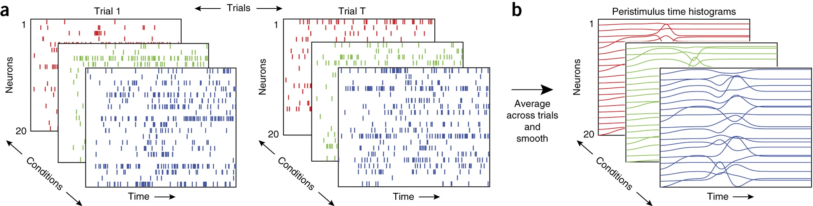
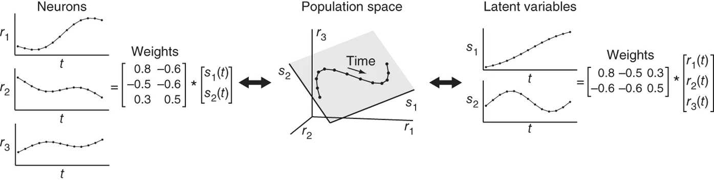
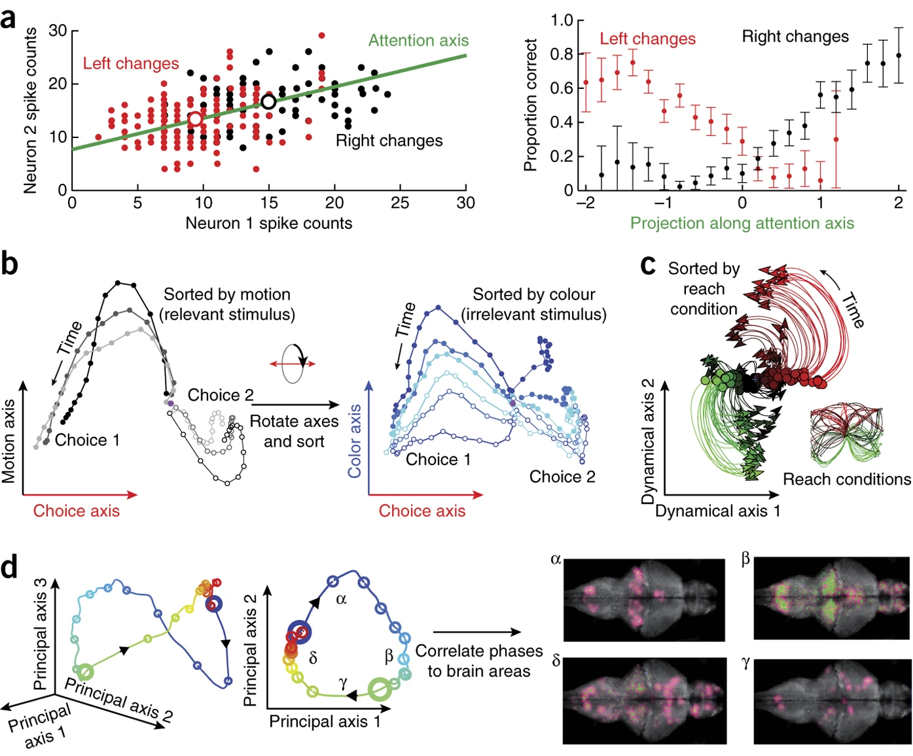
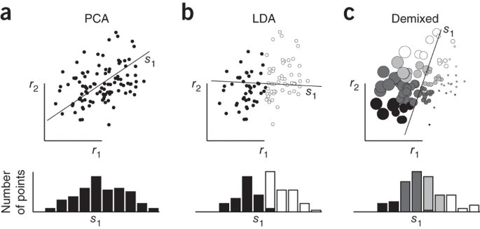

Dimensionality reduction for large-scale neural recordings
大规模神经记录的降维

### Abstract
大多数感觉、认知和运动功能依赖于许多神经元的相互作用。近年来，对大量神经元进行连续或同步记录的技术得到了迅速的发展和越来越多的应用。一个关键的问题是，除了单独研究每个神经元之外，研究记录的神经元群体(**population analysis**)可以获得什么样的科学洞察力。在这里，我们考察了群体分析的三个重要动机：考虑统计科学的单试验假设、神经元集群反应(**population response**)结构的假设和大数据集的探索性分析。最近的许多研究采用降维的方法对这些种群进行分析，寻找在单个神经元水平上不明显的特征。我们描述了集群分析中常用的降维方法，并对方法的选择和结果的解释提供了实用的建议。这篇综述旨在为那些试图理解降维在系统神经科学中已经和可能发挥的作用，并试图将这些方法应用于自己的数据的实验和计算研究人员提供参考。

神经科学的一个中心原则是，我们大脑的卓越计算能力是由相互连接的神经元群体产生的。事实上，我们发现自己正处于神经科学史上令人兴奋的时刻，因为该领域正在经历记录的神经活动的数量和复杂性的快速增长。许多小组已经开始采用多电极和光学记录技术，可以同时监测皮层和在某些情况下更深层结构中许多神经元的活动。不断发展的记录技术有望将同时记录的神经元数量提高一个数量级。与此同时，计算能力的大规模增加和算法的发展使得对神经群体活动的高级多元分析成为可能，其中神经元可以被顺序或同时记录。

这些技术进步使研究人员能够重新考虑正在提出的科学问题的类型以及如何分析神经活动，即使是已经研究了几十年的经典的行为任务和的脑区。事实上，许多神经系统的研究正在经历从单个神经元到群体水平的假设和分析的范式转变。我们首先讨论了联合考虑神经群体的三个科学动机，而不是基于单个神经元：**需要统计能力的单一试验假设，群体反应结构的假设和大数据集的探索性分析。** 关键的是，我们表明，在某些情况下，数据根本不能在单个神经元的基础上理解，不管是由于神经脉冲变异性(**spiking variability**)的结果，还是关于神经机制的假设，这取决于多个神经元的反应如何。
> three important motivations for population studies: single-trial hypotheses requiring statistical power, hypotheses of population response structure and exploratory analyses of large data sets.

本综述的目的是关注一类统计方法，即降维，它非常适合分析神经群体活动。降维方法产生高维数据的低维表示，其中的表示被选择来保留或突出数据中感兴趣的某些特征。这些方法已经开始揭示各种现象背后的神经机制的诱人证据，包括前额叶皮层在决策过程中对感觉输入的选择和整合，前运动皮层在不执行它们的情况下准备动作的能力，嗅觉系统中的气味辨别。在决策、运动系统、嗅觉系统等研究中，以及工作记忆、视觉注意、听觉系统、规则学习、语音等研究中，降维也被卓有成效地应用于群体记录。我们介绍了降维方法，并汇集了以前使用这些方法来解决群体分析的三种科学动机的研究。由于降维的使用在系统神经科学中仍然是比较新的，我们随后提出了方法细节和实际考虑。神经科学领域的许多工作是在过去十年中发展起来的：正如Brown等21所预见的那样，"未来的挑战是设计能够真正让神经科学家对多个锋电位数据进行多元分析的方法"。降维是许多研究人员已经回答并将继续回答这一挑战的重要途径之一。

### Scientific motivation of population analyses
记录技术的规模和分辨率的增长给神经活动的分析带来了挑战。考虑一个来自多个模拟神经元"录制"的动作电位的教学示例，跨越多个实验条件的多个实验试次随着神经元数量、试验和条件的增加，从这些脉冲序列中提取有意义的结构变得越来越具有挑战性。事实上，经典的在假定相似的试验中平均锋电位串和在时间上平滑的方法(图1b )仍然可能产生难以解释的反应。尽管有这种明显的复杂性，但在研究神经元群体方面也有很大的科学机会；在这里我们讨论这些科学动机。

> Figure 1 群体分析和降维的动机。( a )由于神经记录技术在规模和分辨率上的增长，一个典型的 **实验(experiment)** 产生了许多 **试次(trial)**(从左到右的面板组)、许多实验条件(深度显示不同的彩色面板)和许多神经元(每个面板的行,如尖峰栅格所示)的集合。对这些数据进行定性和定量的分析，无论是对基本的理解还是对假设的检验，都提出了许多挑战。(b)神经响应通常在(在给定的条件下)试次中进行平均，并平滑成一个刺激周期时间直方图。即使是这些试算平均的观点也很难解释，因为条件和记录神经元的数量都在增加。值得注意的是，这种挑战即使在结构简单的数据中也可以存在：这些模拟神经元中的每个神经元都具有泊松脉冲，其潜在的放电频率是三个高斯脉冲的加窗线性混合。每个神经元具有不同的混合系数、基线和幅值。降维是一类可以从这些看似复杂的数据中提取出简单结构的统计方法。

### Single-trial statistical power
如果神经活动不是外部可测或可控制变量(例如,如果活动更多地是内部加工的反映,而不是刺激驱动或可测量的行为)的直接函数，那么**在名义上相同的试次上，神经反应的时间进程可能存在显著差异**，对于涉及注意力、决策等认知要求较高的任务而言，情况尤其如此。在这种情况下，**跨试次的平均反应可能会模糊感兴趣的神经时间过程，因此单试次分析是必不可少的**。通过记录单个神经元的反应，通常很难识别这些类型的内部认知过程的逐时波动。然而，如果同时记录多个神经元，则可以利用神经元之间的统计能量来提取单个实验中群体活动的简洁概括

例如，考虑一项决策任务，在该任务中，受试者可能会突然改变主意或在个别试验的可能选择之间摇摆不定。如果这些切换在不同试验的不同时间发生，则试验平均的动作将模糊每个试验的切换时间。在最坏的情况下，试验平均可能会误导科学解释: 在这个例子中，突然且时间不定的思维切换在进行试次平均时会显示为缓慢过渡，这暗示了（与原本突然且时间不定）不同的神经机制。群体活动分析(population analysis)严格地解决了试验平均的这一缺点: **在一次试验中考虑多个神经元，而不是在多次试验中考虑单个神经元，以获得提取去噪的单次试验神经时间过程所需的统计信息。然后，这些时间过程可以在逐个试次的基础上与受试者的行为相关，从而可能推导有关决策的神经基础的新见解。** 下面，我们将显示降维方法是该统计分析的自然选择，如上述研究所使用的。

### Population response structure.
在可能存在涉及跨神经元的反应协调的神经机制的设置中，群体分析是必要的。这些机制仅存在于种群水平，而不存在于单个神经元水平，因此单个神经元的反应可能显得无可救药，令人困惑，或者更糟糕的是，可能会误导对真正生物学机制的研究。**事实上，在更高级别的大脑区域 ，以及更接近感觉输入和运动输出 的区域，已经产生了高度异质和复杂的单神经元反应，跨神经元和跨实验条件。** 在某些情况下，单神经元反应可能与可以在外部测量的感觉输入或运动输出没有明显的逐时刻关系。传统上，这种异质性被认为是生物噪声或其他混淆的结果，并且研究人员通常只研究在外部可测量的数量方面 “有意义” 的神经元。**但是，这种单神经元复杂性可能是仅存在与群体水平上的一致可测的神经机制的体现。**

为了使这个概念具体化，将一个假设的神经回路视为一个动力系统，从某种意义上说，其组成神经元的活动随时间而变化。就像弹跳球的运动受牛顿定律控制一样，该神经回路中的活动也受动力学规则(**例如，点吸引子，线吸引子或振荡: point attractors, line attractors or oscillations**) 控制。尽管单神经元反应肯定表达了这些动力学规则的各个方面，但关键的概念点是，如果没有神经集群，就无法理解孤立的单神经元反应或真正的机制。通过分析神经元群体的记录，可以测试神经机制是否存在，无论是动态过程(dynamical process)还是其他类型的 **群体活动结构(population activity structure)**。降维是形成和评估有关种群活动结构假设的关键统计工具。

### Exploratory data analysis.
研究神经元群体有助于数据驱动的假设生成。这个动机和以前的动机之间有一个微妙但重要的区别。**群体反应结构(population response structure)** 与存在于群体水平的机制有关，不能解释为单神经元假设或机制。另一方面，探索性数据分析涉及可视化大量数据，这可以帮助得到关于单个神经元或群体的假设。当神经元显示出不同的反应特性时，同时和内聚地解释所有反应可能是具有挑战性的 (图1)。将群体作为一个整体来考虑提供了一种可以一起解释所有数据 (跨神经元、条件、试次和时间) 的方式。该步骤提供了对数据的显著特征的初步评估，并且可以指导后续分析。 此外，可视化是在大型数据集上执行健全性检查的有效方法 (例如，在相同实验条件的试验中看到神经活动比在不同条件的试验中更相似，或者检查整个实验过程中的记录稳定性)。这有利于实验设计的快速迭代。通过给出高维群体活动的低维总结来进行降维是执行探索性数据分析的自然方法。

### Intuition behind dimensionality reduction
降维通常应用于有D个测量变量的情况，但人们怀疑这些变量是根据较少数量的解释变量K (式中: K < D)进行的。降维方法根据每个方法特有的目标，从高维数据中发现并提取这些K个解释变量。这些解释变量通常被称为**潜变量(latent variables)**，因为它们不是直接观测到的。通常，任何未被潜变量捕捉到的数据方差都被认为是噪声。在这种观点下，**降维就像许多统计方法一样：它提供了感兴趣的统计特征的简洁描述，并将数据的某些方面作为噪声丢弃。**

在**神经群体活动的情况下，D通常对应于记录的神经元的数量。** 因为记录的神经元属于共同的基础网络，所以记录的神经元的响应可能不是彼此独立的。因此，与记录的神经元数量相比，可能需要更少的潜在变量来解释种群活动。潜在变量可以被认为是共同的输入，或者更一般地，被认为是未观察到的神经元在与记录的神经元相同的网络中的集体角色。**此外，许多降维方法认为，单个神经元发出的动作电位的时间序列可以由基础的，随时间变化的放电率表示，从该放电率以随机方式生成动作电位。** 这是神经科学中的普遍观点，无论是隐含地 (例如，在试验中平均尖峰序列以估计随时间变化的放电率) 还是明确地 (例如，尖峰序列的统计模型)。先前的**研究表明，随机成分倾向于泊松状，我们将其称为尖峰变异性(spiking variability)。** 降维的目标是表征不同神经元的放电速率如何共变，同时将尖峰变异性作为噪声丢弃。因此，D个神经元中的每一个都可以被认为提供了由K个潜在变量捕获的基础共享神经过程的不同的，嘈杂的视图。潜在变量定义了K维空间，该空间表示在群体响应中突出的共享活动模式。

为了说明，考虑D = 3个神经元的情况。我们首先定义一个高维空间，其中每个轴代表一个神经元的放电率 (r 1 ，r 2 和r 3 ; 图2)。在此框架中，种群活动的每个向量 [r 1 ，r 2 ，r 3 ] 对应于该空间中的一个点。然后我们可以问什么低维 (K < D) 空间能很好地解释这些数据。在图2中，这些点位于一个平面上 (灰色阴影，K = 2)，并描绘出随时间变化的轨迹。每个时间点t对应于高维发射率空间中的单个点 [r 1 (t)，r 2 (t)，r 3 (t)]。请注意，时间未绘制在任何轴上; 每个轴表示一个神经元的放电率，并且时间在轨迹上隐式地演变。

> Figure 2: Conceptual illustration of linear dimensionality reduction for three neurons (D = 3) and two latent variables (K = 2).
> 中间，群体活动 (黑点) 位于一个平面 (灰色阴影)。每个点代表特定时间的群体活动，并且可以使用其高维坐标 `[r1, r2, r3]` 或低维坐标 `[s1, s2]`。这些点描绘出随时间的轨迹 (黑色曲线)。左边，可以通过对潜在变量进行加权组合来重建种群活动r1，r2 和r 3 ，其中权重由所示矩阵指定。右，潜变量s1 和s2 可以通过对群体活动进行加权组合来获得，其中权重由所示矩阵指定。

有两种互补的方式来思考线性降维的潜在变量和群体活动之间的关系。首先，可以通过对潜在变量进行加权组合来重建群体活动，其中权重由降维方法确定 (图2)。每个潜在变量时间过程 (s 1 (t) 和s 2 (t)) 可以被认为是时间基函数: 不同神经元共享的共变化活动的特征模式。权重矩阵的第一列和第二列分别指定三维空间中的s 1 和s 2 轴 (图2)。因此，可以将每个权重视为指定在重建每个神经元的响应时使用每个时间基础模式的多少。 其次，潜变量可以被认为是高维群体活动的低维读数或描述 (在 [s 1 ，s 2 ] 空间中; 图2)。每个潜在变量可以简单地通过对不同神经元的活动进行加权组合来获得。一般来说，[r 1 ，r 2 ，r 3 ] 空间中的点将不会正好位于一个平面上。在这种情况下，降维尝试找到可以尽可能地重建群体活动的潜在变量。重建的活动可以解释为每个神经元的去噪放电率。

### Scientific studies using dimensionality reduction
在建立了降维的直觉之后，我们讨论了这些方法在神经科学文献中的用途以及它们所揭示的见解，这些见解是由分析神经种群的三种科学动机组织的。

#### Single-trial statistical power.
越来越多的工作利用跨多个神经元的统计能力来表征单次试验中的群体活动。一个突出的例子是视觉注意力的研究，尽管实验者尽了最大的努力，但视觉注意力可能每时每刻都在变化。为了研究视觉注意的神经机制，在变化检测任务期间，从猴子区域V4的神经元群体中记录了一组数据。然后，他们通过将群体活动投影到一维 **"注意轴(attention axis)"** (图3a) 来建立注意力的单次试验测量，这是一条线 (K = 1) 上的降维。注意轴由每个神经元在每个注意条件下的平均响应定义。值得注意的是，作者发现在注意轴上的投影在逐个试验的基础上预测了行为表现 (图3a)，这是在单个神经元水平上不可能看到的效果。 这一发现的关键是预测，它利用整个群体记录的统计能力，在单次试验的基础上估计潜在的注意力状态。

> Figure 3: Examples of scientific studies using dimensionality reduction. 
> (a) 单试验统计能力，视觉注意力。左，一个将两个神经元的反应投射到注意轴上的教学示例 (绿色; 单位，尖峰计数)。对于V4群体 (右)，沿此注意轴的标准化位置 (即投影) 可预测单次试验中的行为: 投影距离注意轴的右上方越远，动物越可能正确地检测到右侧变化，并且动物越不可能正确地检测到左侧变化。
> (b) 群体反应结构，决策。前额叶皮层中记录的群体活动被投影到三个轴上 (单位,`spikes/s`): 1. evidence integration (choice axis); 2. relevant stimulus axis (motion axis); 3. irrelevant stimulus axis (color axis). 每个迹线对应于在相同的点运动 (灰色迹线) 或点颜色 (蓝色迹线) 的试验中平均的响应。 尽管单神经元反应明显复杂，但种群活动在不同的点运动和颜色条件下显示出有序的结构，并提出了一种在前额叶皮层中门控和整合信息的网络机制。
> (c) 群体反应结构、运动系统。运动皮层中记录的种群活动被投影到一个平面上 (单位，每s的峰值)，在该平面上可以最好地捕获简单的 (旋转) 动力学; 不同的痕迹是不同的实验条件 (在图中显示相同颜色的手臂)。点表示预备 (运动前) 神经活动，暗示了对单个神经元复杂性的机械解释: 预备响应设置了贯穿运动的种群水平动力学系统的初始状态。经参考文献11许可改编。(d) 探索性数据分析，全脑。 为了可视化的目的，将整个幼体斑马鱼大脑中记录的种群活动投影到其主要成分上 (左侧显示的相同数据以三维和二维绘制，单位为 Δ F/F)。识别出四个反应阶段 (标记为 α，β，γ 和 δ)，然后将其连接回不同的神经结构。右，每个阶段的轴向视图，其中绿点表示具有洋红色置信区间的活动神经元 (尾-尾为左-右)。经参考文献50许可改编。

还有其他几种关键的实验环境，将降维应用于种群活动以揭示单次试验神经现象，包括决策研究、规则学习、运动规划和刺激定位。在这些研究中，仅使用群体响应进行降维，而不参考受试者的行为。然后，该行为被用于在单次试验的基础上验证提取的潜变量。可以使用类似的方法来研究群体活动在具有异常行为的试验 (即错误试验) 上的差异。

降维对于研究 **自发活动(spontaneous activity)** 也很有价值，因为没有可重复试验的概念，因此必须在单次试验的基础上进行分析。根据定义，自发活动涉及不受实验者直接控制的群体活动的波动。为了表征自发活动，可以应用降维来提取每个时刻的低维网络状态。这有助于在感觉和动作期间将自发活动与群体活动进行比较。

#### Population response structure.
降维的另一个关键用途是测试仅在总体水平上有意义的科学假设。群体结构假设在几个不同的系统中得到了积极的追求，包括前额叶皮层、运动系统和嗅觉系统。这些系统的一个共同主题是，尽管神经反应在单个神经元的水平上可能显得无可救药地复杂，但在总体水平上存在更简单的组织原则。

在前额叶皮层中，一项研究检查了决策任务中相关和不相关刺激信息的表示，该任务包括72个不同的实验条件，涉及屏幕上点的运动和颜色 (图3b)。在这项任务中，作者记录了前额叶皮层中的1,000多个神经元，产生了一个庞大的反应数据库，这些反应不容易总结或理解，这是单神经元复杂性的典型例子。鉴于在单个神经元水平上缺乏简单的解释，他们探讨了是否可以将混杂的单神经元反应理解为种群水平上简单动力学过程的观点。设计了一种降维方法来识别共享的潜在变量，每个潜在变量都解释了外部协变量(external covariate) (受试者的选择，点运动，点颜色或其它任务指标)。**值得注意的是，低维表示是群体活动的简单投影，而不是这些协变量的解码估计.** 将这种方法应用于实验数据，作者发现种群活动与涉及线吸引子的低维动力学过程一致 (图3b)，这不能通过检查孤立的单个神经元来识别。此外，他们发现，群体活动令人惊讶地携带了相关和不相关的刺激信息，并且可以通过读出机制沿着群体空间中与任务相关的方向隐含地实现 “门控”，这是一个固有的群体水平概念。他们对降维的使用也在群体记录和网络理论之间架起了一座桥梁，其中实验数据和模型都表明了类似的信息门控动态过程。 该机制还预测，对于不同的任务上下文，动态过程在总体空间中将具有不同的方向，可以通过实验进行测试以验证或使该机制无效。通过明智地使用降维来检查群体响应结构，可以实现实验与理论之间的这种联系。

在运动系统中，研究者通过在具有108不同实验条件的任务期间记录初级运动皮层中的数百个神经元来研究reach准备和执行 (图3c)。与前面的示例 4 一样，单神经元反应的异质性很难解释。通过应用降维，他们在总体水平上发现了一种连贯的机制: **准备活动设置了动态过程的初始状态，该动态过程随着运动的执行而展开。** 仅用单神经元响应不能理解这种动态结构，并且需要群体分析来揭示任务的两个阶段之间的这种合法协调 (图3c)。这种结构进一步预测了在单个神经元水平上任务的准备阶段和执行相关阶段之间的神经元调谐缺乏相关性，如先前观察到的。 最近，降维被用来表明，与相关信息的读出方向相似的群体水平机制是准备阶段期间运动系统中运动的隐式门控的基础。

最后，还通过种群反应结构的镜头考虑了嗅觉系统中神经元对不同气味的反应。在这里，跨神经元和气味刺激的不同时间进程混淆了理解这些气味的基本编码的尝试。随着神经元数量和刺激条件的增加，这项任务变得越来越困难。降维已应用于蝗虫触角叶800个神经元中大约100个的活动，并且种群活动可追溯到由刺激条件组织的圆圈。特别是，环的方向与气味身份有关，环的大小与气味浓度有关。 这些结果以重要的方式进行了扩展，以阐明这种编码的时间动力学，上游嗅觉受体神经元的编码，时间结构化的气味刺激，气味的快速时间波动，重叠气味的编码，气味混合物的编码 等等。

### Exploratory data analysis.
降维也是对大型神经数据集进行探索性数据分析的有用工具。一个有说服力的例子来自斑马鱼幼虫整个大脑的光学记录，在运动适应过程中以细胞分辨率记录数据 。在这个和类似的实验中记录的数据量是惊人的: 超过80,000个神经元每小时记录的活动超过1TB。为了可视化并开始理解这些数据，作者应用降维来揭示四种不同类型的神经动力学 (图3d)。然后，他们将这种见解与神经结构联系起来，发现这些动态机制中的每一个都对应于不同大脑区域中的单个神经元，这表明这些区域中的每一个都有新的作用。因此，降维可以形成有关单个神经元响应特性的新假设。

即使当从更适度数量的神经元记录时，也需要以简洁的方式可视化群体活动的方法。降维已用于各种大脑区域的数据可视化和假设生成，包括运动皮层，海马 ，额叶皮层，听觉皮层，前额叶皮层，纹状体皮层和嗅觉系统。**尽管这些研究中的大多数都使用原始神经活动 (没有降维) 来检验假设，但降维的使用对于首先生成假设并指导后续分析至关重要。** 随着神经数据集规模的增长，通过降维促进的假设生成和数据分析之间的相互作用可能变得越来越重要。

### Selecting a dimensionality reduction method
如上一节所述，有许多降维方法，每种方法在其保留和丢弃的统计结构上有所不同。尽管许多方法具有很深的相似性 ，但与任何统计技术一样，方法的选择可能会对可以做出的科学解释产生重大影响。出于这个原因，并且由于降维的使用在系统神经科学中仍然是相对较新的，因此以下两个部分将介绍这些方法的新用户，以帮助现有用户进行方法选择和解释，并描述每个选择的潜在陷阱。我们描述了最常用于神经活动的降维方法(表1)，并为其适当使用提供了指导。 尽管下面的描述集中在尖峰序列的电记录上，但这些方法同样可以很好地应用于来自光学成像和其他类型的神经信号的荧光测量。

Method | Analysis objective| Temporal smoothing |Explicit noise model | Representative uses in neuroscience (refs.)
:-|:-|:-|:-|:-|
PCA|Covariance|No|No|[6](https://www.nature.com/articles/nn.3776#ref-CR6 "Mazor, O. & Laurent, G. Transient dynamics versus fixed points in odor representations by locust antennal lobe projection neurons. Neuron 48, 661–673 (2005)."), [29](https://www.nature.com/articles/nn.3776#ref-CR29 "Churchland, M.M. et al. Cortical preparatory activity: representation of movement or first cog in a dynamical machine? Neuron 68, 387–400 (2010)."), [50](https://www.nature.com/articles/nn.3776#ref-CR50 "Ahrens, M.B. et al. Brain-wide neuronal dynamics during motor adaptation in zebrafish. Nature 485, 471–477 (2012).")
FA|Covariance|No|Yes|[10](https://www.nature.com/articles/nn.3776#ref-CR10 "Churchland, M.M. et al. Stimulus onset quenches neural variability: a widespread cortical phenomenon. Nat. Neurosci. 13, 369–378 (2010)."), [43](https://www.nature.com/articles/nn.3776#ref-CR43 "Sadtler, P.T. et al. Neural constraints on learning. Nature (in the press)."), [100](https://www.nature.com/articles/nn.3776#ref-CR100 "Santhanam, G. et al. Factor-analysis methods for higher-performance neural prostheses. J. Neurophysiol. 102, 1315–1330 (2009).")
LDS/GPFA|Dynamics|Yes|Yes|[12](https://www.nature.com/articles/nn.3776#ref-CR12 "Yu, B.M. et al. Gaussian-process factor analysis for low-dimensional single-trial analysis of neural population activity. J. Neurophysiol. 102, 614–635 (2009)."), [71](https://www.nature.com/articles/nn.3776#ref-CR71 "Smith, A.C. & Brown, E.N. Estimating a state-space model from point process observations. Neural Comput. 15, 965–991 (2003)."), [72](https://www.nature.com/articles/nn.3776#ref-CR72 "Kulkarni, J.E. & Paninski, L. Common-input models for multiple neural spike-train data. Network 18, 375–407 (2007).")
NLDS|Dynamics|Yes|Yes|[77](https://www.nature.com/articles/nn.3776#ref-CR77 "Yu, B.M. et al. Extracting dynamical structure embedded in neural activity. Adv. Neural Inf. Process. Syst. 18, 1545–1552 (2006)."), [78](https://www.nature.com/articles/nn.3776#ref-CR78 "Petreska, B. et al. Dynamical segmentation of single trials from population neural data. Adv. Neural Inf. Process. Syst. 24, 756–764 (2011).")
LDA|Classification|No|No|[9](https://www.nature.com/articles/nn.3776#ref-CR9 "Briggman, K.L., Abarbanel, H.D.I. & Kristan, W.B. Jr. Optical imaging of neuronal populations during decision-making. Science 307, 896–901 (2005)."), [19](https://www.nature.com/articles/nn.3776#ref-CR19 "Durstewitz, D. et al. Abrupt transitions between prefrontal neural ensemble states accompany behavioral transitions during rule learning. Neuron 66, 438–448 (2010)."), [56](https://www.nature.com/articles/nn.3776#ref-CR56 "Bartho, P. et al. Population coding of tone stimuli in auditory cortex: dynamic rate vector analysis. Eur. J. Neurosci. 30, 1767–1778 (2009).")
Demixed|Regression|No|Yes/No|[4](https://www.nature.com/articles/nn.3776#ref-CR4 "Mante, V. et al. Context-dependent computation by recurrent dynamics in prefrontal cortex. Nature 503, 78–84 (2013)."), [16](https://www.nature.com/articles/nn.3776#ref-CR16 "Machens, C.K. et al. Functional, but not anatomical, separation of 'what' and 'when' in prefrontal cortex. J. Neurosci. 30, 350–360 (2010).")
Isomap/LLE|Manifold discovery|No|No|[14](https://www.nature.com/articles/nn.3776#ref-CR14 "Saha, D. et al. A spatiotemporal coding mechanism for background-invariant odor recognition. Nat. Neurosci. 16, 1830–1839 (2013)."), [44](https://www.nature.com/articles/nn.3776#ref-CR44 "Stopfer, M., Jayaraman, V. & Laurent, G. Intensity versus identity coding in an olfactory system. Neuron 39, 991–1004 (2003)."), [58](https://www.nature.com/articles/nn.3776#ref-CR58 "Carrillo-Reid, L. et al. Encoding network states by striatal cell assemblies. J. Neurophysiol. 99, 1435–1450 (2008).")

#### Basic covariance methods.
主成分分析 (PCA) 和因子分析 (FA) 是两种最基本、最常用的降维方法。为了说明的目的，考虑D = 2个神经元和K = 1个潜在变量的情况 (图4a)。我们首先形成原始或处理 (例如，试验平均) 尖峰计数的高维向量。每个数据向量对应于图4a中的一个点。PCA识别捕获数据中的最大方差的正交方向的有序集合。最大方差的方向由s1 表示。正交s2 轴 (未示出) 是捕获最小方差的方向。然后可以将数据投影到s 1 轴上，形成最好地保持数据协方差的一维数据集 (图4a)。

> Figure 4: Conceptual illustration of PCA, LDA and demixed dimensionality reduction for two neurons (D = 2). 
> (a) PCA找到捕获数据中最大方差的方向 (s 1 轴) (黑点，顶部)，如投影到s 1 轴 (底部) 所示。
> (b) LDA找到最能将两组点 (黑色和while点，顶部) 分开的方向 (s 1 轴)。在s 1 轴 (底部) 上的投影中可以看到分离。
> (c) 混合降维 (使用参考文献16中描述的方法) 找到解释点颜色 (s 1 轴，顶部) 和正交方向 (s 2 轴，未显示)，这解释了点大小的差异。在s 1 轴 (底部) 上的投影中可以看到点颜色的组织。 请注意，这些插图是使用相同的数据点 (点) 创建的，并且是使用不同的方法 (利用不同的数据特征，例如 (b) 中的组成员身份或 (c) 中的颜色和大小)，它们在顶部面板上产生不同的方向s 1 ，在底部面板上产生不同的投影。

尽管在某些情况下可能需要捕获最大量的方差，但需要注意的是，PCA识别的低维空间捕获了所有类型的方差，包括**发射率变异性和尖峰变异性(firing rate variability and spiking variability)**。由于尖峰变异性可能会掩盖潜在变量的解释，因此PCA通常应用于试验平均 (在某些情况下，时间平滑) 尖峰计数，其中平均会提前消除大部分尖峰变异性。如果试图分析原始尖峰计数，则可以使用FA更好地将发射率的变化与尖峰变异性分开。FA标识了一个低维空间，该空间保留了神经元之间共享的方差 (被认为是放电率变异性)，同时丢弃了与每个神经元无关的方差 (被认为是尖峰变异性) 。**FA可以被看作是添加了显式噪声模型的PCA，该显式噪声模型允许FA丢弃每个神经元的独立方差。**

### Time series methods.
如果数据形成时间序列，则可以利用数据的顺序性质来提供进一步的去噪并表征群体活动的时间动态。尽管针对多神经元尖峰序列量身定制的时间序列方法有了许多重要的发展 (例如，参见参考文献62、63、64、65、66、67)，但我们专注于这些方法的一个子集，这些方法**以无监督的方式识别低维结构** (即，如果没有直接观察到神经活动的一些或所有预测因子)。

有几种可用于时间序列的降维方法: **隐马尔可夫模型(HMM) 22,23,24,26,68,69,70; 核平滑然后静态降维方法(kernel smoothing followed by a static dimensionality reduction method); 高斯过程因子分析 (GPFA) 12 ; 潜在线性动力系统(latent linear dynamical systems, LDS) 71,72,73,74,75,76; 潜在非线性动力系统 (NLDS) 77,78** 所有这些方法都返回低维的潜在神经轨迹，这些轨迹捕获每个高维时间序列的神经元之间的共享可变性。HMM应用于群体活动被认为在离散状态之间跳跃的设置中，而所有其他方法都可以识别激发速率随时间的平滑变化 (其中平滑程度由数据确定)。**表征神经元群体的试验平均响应的常见方法是在试验中平均并在时间上平滑每个神经元的响应，然后应用PCA。** 这产生了每个实验条件的神经轨迹，并有助于比较不同条件的群体活动。相比之下，HMM、GPFA、LDS和NLDS通常应用于单次试验群体活动。这产生了单次试验神经轨迹，这有助于比较试验和低维动力学模型之间的种群活动，该模型表征了种群活动随时间的演变。这些方法特别适用于单试验群体活动，因为它们具有显式的噪声模型 (类似于FA)。

作为警告，在解释神经轨迹时，重要的是要理解从高维群体活动中提取它们所涉及的步骤和假设。对于具有显式动力学模型的方法，其参数首先适合一组 (训练) 试验。然后，可以通过在动力学模型和噪声 (测试) 数据之间进行统计折衷来提取低维轨迹。因此，特定的低维轨迹可以是动态模型与数据一样多的反映。例如，GPFA中的动力学模型是固定的，并鼓励轨迹平滑，而LDS和NLDS中的动力学模型通常是非固定的，并鼓励轨迹遵循特定的动力学主题。因此，我们建议采用简单的第一种方法，例如对平滑的试验平均数据进行PCA或对单次试验数据进行GPFA，然后可以指导选择有向动力学模型，例如LDS或NLDS。 在所有情况下，在动力学模型鼓励的结构类型的背景下，应谨慎解释提取的轨迹。

如果寻找作为数据的投影的轨迹 (不需要与动力学模型的统计折衷)，则可以在使用涉及动力学模型的方法识别出低维空间之后使用正交投影 (类似于PCA) 来提取低维轨迹。然后，所提取的轨迹仅仅是数据的投影，并且没有受到动力学模型的约束，其折衷是放弃将由动力学模型提供的轨迹的去噪。开发了这种方法来研究神经种群动力学的旋转结构。

### Methods with dependent variables.
在许多实验设置中，高维激发速率空间中的每个数据点具有一个或多个 **因变量** 的关联标签。这些因变量可以对应于实验参数 (例如，刺激身份) 、受试者的行为 (例如，决策身份) 或时间指数。降维的可能目标是投影数据，使得这些因变量中的差异得以保留，这与上述以无监督方式发现群体活动中的结构的所有方法形成对比。如果每个数据点属于G个组中的一个 (例如，实验条件)，则可以使用线性判别分析 (LDA) 来找到一个低维投影，其中G个组被很好地分离 9,19,56 。LDA标识G − 1个方向的有序集合，其中组间方差相对于组内方差最大化。 考虑具有D = 2个神经元和G = 2个组的示例 (图4b，顶部)。当数据点投影到s 1 轴上时，两组很好地分开。

**如果每个数据点都有多个因变量 (例如，刺激身份和决策身份)，则可能会寻求 “分离(demix)” 不同因变量的影响，以便每个投影轴 (即潜在变量) 捕获单个因变量的方差。** 这通常有助于通过在外部可测量变量方面对投影轴赋予意义来在低维空间中定向用户。神经科学文献中使用了三种密切相关的方法，我们统称为**分层降维: 线性回归的变体 4 ，协方差方法 16 和概率扩展 57 。** 考虑具有D = 2个神经元和每个数据点的两个属性 (点大小和点颜色) 的示例 (图4c)。 对这些数据应用demixed降维产生方向s 1 ，其最佳地解释了点颜色的变化，以及正交方向s 2 (未示出)，其解释了点大小的变化。当将数据点投影到s 1 上时，可以看到点颜色的组织。通过将数据投影到正交的s 2 轴上，可以看到点大小的类似组织。**注意，这两个属性沿正交轴变化 (图4c)，尽管在实际数据中不一定是这种情况。** 从方法上讲，当因变量取连续值 (而不是几个离散值) 时，应使用线性回归的变体，而当因变量的值没有明显的顺序时，应使用协方差方法的差异。因变量 (例如，不同的刺激类别)。

迄今为止提出的大多数方法定义了潜在变量和观察变量之间的线性关系 (图2和4)。通常，数据可能位于高维空间中的低维非线性流形上。根据非线性的形式，线性方法可能需要比数据中真实维数更多的潜在变量。**识别非线性流形的两种最突出的方法是Isomap 79 和局部线性嵌入 (LLE) 13,14,44,45,58,80。** 与线性方法一样，应谨慎解释非线性方法产生的低维嵌入。几种非线性方法使用局部邻域来估计流形的结构。由于群体响应通常不会均匀地探索高维空间 (随着神经元数量呈指数增长的问题)，因此局部邻域可能仅包括沿同一轨迹的时间相邻点。 结果，轨迹之间的差异可以在低维嵌入中被放大，并且应当被相应地解释。为了获得高维空间的更均匀采样，有必要大幅增加标准任务范例 (例如，所呈现的刺激或引发的行为) 的丰富性和多样性。此外，**非线性降维方法在存在噪声 81 的情况下通常很脆弱，这限制了它们在单次试验群体分析中的使用**。这些警告建议线性降维是大多数分析的明智起点。在进行非线性方法之前，应确保对高维空间进行足够密集的采样，以使局部邻域涉及来自不同轨迹 (或实验条件) 的数据点，并且在单次试验分析的情况下，非线性方法对神经元的泊松样尖峰变异性具有鲁棒性。

### Practical use 
根据所提出的科学问题，应首先使用上述准则选择适当的降维方法。然后，可以执行必要的数据预处理 (例如，采用尖峰计数，跨试验平均和/或跨时间平滑)，并将所选方法应用于种群活动。该后一步骤包括找到潜在维度，估计模型参数 (如果适用)，以及将高维数据投影到低维空间中 (类似于图2)。这产生了群体活动的低维表示。本节提供了预处理数据，估计和解释潜在维度，运行选定的降维方法以及可视化低维投影的实用指南。 我们指出了特定于群体活动分析的警告和潜在陷阱，以及与高维数据分析有关的更一般的陷阱。

#### Data preprocessing.
应该对数据进行预处理，以确保降维的合理输入。存在一些典型的陷阱。首先，应该确保神经元不会由于琐碎的 (即非生物学的) 原因而共同变化，这可能会严重混淆任何降维方法。**例子包括电极之间的电交叉耦合，其诱导神经元之间的正相关 12 ，以及人为地将单个神经元的响应分成两个 (无论是由于光学记录中的神经元接近还是由于电极记录的尖峰排序)，这导致神经元之间的负相关。** 其次，通常应**排除具有低平均放电率 (例如，小于每秒一个尖峰) 的神经元，因为任何神经元的几乎零方差可能导致某些方法的数值不稳定。** 第三，**对于PCA，可以考虑归一化 (即，z评分) 每个神经元的活动，因为PCA可以由具有最高调制深度的神经元主导。** 对于大多数其他降维方法来说，这不太值得关注，其中潜在变量对于每个神经元的活动规模 61 是不变的。在这些考虑之后，可以通过取装箱的尖峰计数、跨试验求平均和/或跨时间 33 的内核平滑来预处理数据。

#### Estimating and interpreting dimensionality.
估计维数的最基本方法是选择由低维投影解释的方差的截止值，并选择K使得超过截止值。鉴于截止值通常是任意的，交叉验证可能更适合询问有多少维度可以概括为解释保留的数据。对于概率方法 (诸如FA、GPFA、LDS和NLDS)，可以识别使交叉验证的数据似然最大化的维度。或者，对于所有线性方法和某些非线性方法，可以代替数据似然 12 计算交叉验证的leave-neuron-out预测误差。另一种方法是评估可以由线性分类器 15 实现的二进制分类的数量。 通常，估计的维数可能受到估计方法的选择，包括的神经元数量，实验设置的丰富性以及给定数据集中的数据点数量的影响。这些考虑表明，对维度进行相对而不是绝对的陈述更安全。

#### Computational runtime.
尽管对每种方法的计算运行时的详细分析超出了本文的范围，但我们将讨论一些经验法则。对于线性方法，有两个步骤: 估计模型参数，然后将数据投影到低维空间。对于估计模型参数，仅需要单个矩阵分解的方法 (例如PCA和LDA) 往往比方法 (例如FA，GPFA，LDS和NLDS)更快，它们使用迭代算法 (例如期望最大化) 或子空间识别方法 75,76,83 。涉及动力学模型的方法 (例如GPFA，LDS和NLDS) 往往比不涉及动力学模型的方法 (例如FA) 需要更多的计算。相对于估计模型参数，对于所有线性方法，将数据投影到低维空间的第二步往往是快速的。 为了估计潜在维度，交叉验证往往对计算要求很高，因为它要求模型参数拟合m × n次，其中m是交叉验证折叠的数量，n是候选潜在维度的数量。随着记录的神经元数量的持续增长，计算效率将成为神经科学使用降维时越来越重要的考虑因素。

#### Visualization
理想地，人们希望直接在K维空间中可视化所提取的潜变量。如果K ≤ 3，则可以使用标准绘图。对于较大的K，一种可能性是可视化少量的二维投影，这可能会遗漏显着特征或提供潜在变量的误导性印象，尽管存在快速可视化工具以帮助解决此限制

#### Potential pitfalls when analyzing high-dimensional data.
在分析多元数据时，重要的是要记住，来自二维或三维空间的直觉可能不适用于高维空间。例如，可以询问两个不同的低维空间在高维空间中是否具有相似的取向，如通过比较高维空间中的向量之间的角度所评估的。随着维数的增加，两个随机选择的向量将变得越来越正交。因此，正交性的评估应该相对于角度的机会分布进行，而不是从低维空间的直观期望。作为第二个例子，LDA对两类训练数据的分离能力随着数据维度(对于固定数量的数据点)的增加而提高。在足够高的维数下，任意固定数目的数据点可以被任意地很好地分离。这两个例子强调了在分析高维数据时需要谨慎；在文献84中也出现了许多其他的例子。

### Broader connections
我们专注于数据上下文，其中降维是一种适当的分析方法。然而，降维绝不是可用于分析神经群体活动的唯一方法。几十年来，研究一直在考虑神经元对的活动如何协同 21,85,86 。对于更大的群体，研究已经使用基于回归的广义线性模型 (glm)，尖峰词分布和解码方法来表征群体活动。在这里，我们描述了这些相关的方法，它们与降维的联系以及它们可以成为更合适的选择的上下文。

首先，顾名思义，GLM是解释变量与群体活动 87 之间的常规线性高斯关系的概括。GLM可以直接使用泊松计数分布或点过程分布对尖峰序列进行建模。它可以用于观察到解释变量 64,66 或未观察到 (即潜在) 71,72,74,75,76,77 的设置。前者是线性回归的推广，而后者是线性降维的推广。因此，是否使用GLM (而不是更常规的线性高斯模型) 的选择与是否执行降维的选择是分开的。也可以在存在观察到的和未观察到的解释变量的设置中使用GLM 72,88,89 。GLM广泛用于回归设置，以根据整个记录群体和刺激的近期历史来解释神经元的放电。 这种方法适用于人们认为大多数 (或全部) 相关解释变量被观察到的环境，并且可以提供对刺激依赖性和功能连通性的洞察力。相比之下，如果相关的解释变量是未观察到的 (例如，由于网络中的共同输入或未观察到的神经元)，则应使用降维 (有或没有GLM) 74 来解决有关集体种群动态和变异性的问题。

其次，用于表征种群活动的非参数方法是测量观察到每个可能的**尖峰计数向量 (spike count vector (termed spike word)称为尖峰字)** 90,91 的概率。这产生了一个离散的概率分布，然后可以使用信息理论度量跨实验条件进行比较。该方法捕获跨神经元的高阶相关性，并相对于基于二阶统计量和基础放电率 32 的假设的许多降维方法保留尖峰的精确定时。是否有必要考虑高阶相关性 90,91 和精确的尖峰时间 93 取决于正在研究的特定大脑区域或科学问题。由于可能的尖峰词的数量随着神经元的数量呈指数增长，因此尖峰词分析通常仅限于几十个神经元，并且需要大量数据。

第三，降维方法与种群解码方法密切相关。与降维类似，解码将高维群体活动减少到较少数量的变量。一些突出的例子包括解码感官刺激 66,94 ，物理位置 62 ，手臂运动 65,95,96 ，工作记忆 97 ，对象信息 98 等等。关键的区别是解码试图预测外部变量，而降维产生神经活动本身的低维表示 (潜在变量)。解码性能倾向于随着神经元数量的增加而增加的事实表明，与单个神经元 99 相比，一群神经元可以提供有关外部或内部变量的更多信息。

科学的主要追求之一是用简单的术语解释复杂的现象。系统神经科学也不例外，数十年的研究试图在单个神经元的水平上找到简单性。标准分析程序包括构建简单的参数调整曲线和响应场，仅分析记录的神经元的选定子集，以及通过对神经元和试验进行平均来创建群体平均值。最近，研究已经开始拥抱单神经元异质性，并在种群 4,11,15,16 的水平上寻求简单性，这是通过降维实现的。这种方法已经为网络动力学如何产生感觉，认知和运动功能提供了新的见解。 随着对研究认知和其他内部大脑过程的兴趣不断增长，以及大规模记录技术的持续发展和采用，降维和相关方法可能变得越来越重要。

