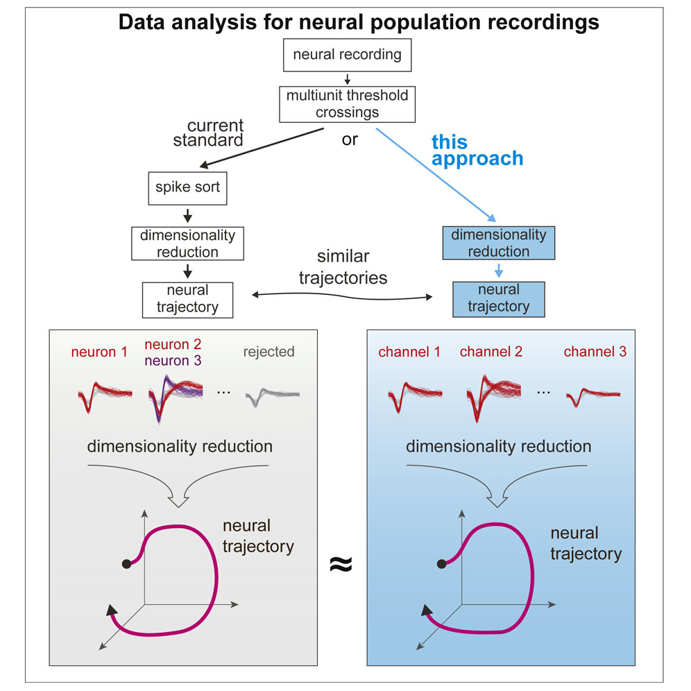

# Accurate Estimation of Neural Population Dynamics without Spike Sorting
Volume 103, Issue 2, 17 July 2019, Pages 292-308.e4

> Highlights
• For population analyses, spike sorting has a minor impact on estimates of neural state
• Multiunit activity creates a random projection of the low-dimensional neural state
• Results from three prior studies in macaque PMd/M1 are replicated without spike sorting
• Neuropixels probes provided high-quality unit isolation to validate findings

### Summary
系统神经科学的中心目标是将生物体的神经活动与行为联系起来。神经种群分析通常会降低数据维度，以专注于相关的活动模式。数据分析的主要障碍是尖峰排序，并且随着记录的神经元数量的增加，这个问题也在增加。在这里，我们调查尖峰排序对于估计神经种群动态是否必要。随机投影理论表明，我们可以从数据的少量线性投影中准确估计低维流形的几何形状。我们使用神经像素探针在非人类灵长类动物的运动皮层中记录数据，并重新分析了之前三项研究的数据，发现使用多单位阈值交叉而不是分类神经元的神经动力学和科学结论非常相似。这一发现为现有数据提供了新的分析，并为实验室和临床使用的新电极阵列的设计和使用提供了信息。

> Keywords
spike sorting, dimensionality reduction, neurophysiology, neural dynamics, random projections, neural trajectories, neural signal processing, brain computer interface, neural implant

### Introduction
跨越系统神经科学的越来越多的研究试图将神经种群状态的动态演变与生物体的行为联系起来. 在这项工作中，我们旨在解决神经生理学实验面临的实际障碍: 我们如何应对将动作电位归因于单个神经元的挑战，称为 “尖峰排序”。随着记录频道的数量从几百个 (目前的状态) 迅速增加到数千个甚至数百万个在不久的将来 (史蒂文森和科丁，2011)？ 神经记录能力的这种令人兴奋和快速的增加对于推进神经科学理解和脑机接口是必要的，并且进展部分是由美国大脑计划和世界各地的类似努力推动的 (Bargmann等人，2014，Koroshetz等人，2018)。**对于由几个小时的神经和行为记录组成的典型实验，甚至100通道的手动尖峰排序也可能需要熟练的研究人员花费几个小时，并且不同的人类专家经常得出不同的结果** (Wood等人，2004)。**自动尖峰排序算法** 显示出希望，但计算量大，并且对由于电极漂移而引起的波形变化敏感，并且通常没有真实数据来验证结果。新方法利用 **高密度神经记录** 来产生可靠的单神经元隔离，但是这种传感器代表了少数新兴技术，因为它们专门针对线性探针周围的小体积内的高密度记录进行了优化。对于给定数量的记录通道，对尖峰分选质量的优化需要从较小体积的组织进行测量。在实践中，这通常与同时从更大的脑体积 (包括从多个脑区域) 进行测量并长时间进行测量的需求 (即，长期植入 [chastek等人，2011，Barrese等人，2013]) 相违背。
在这里，我们研究尖峰排序是否是针对神经种群活动的分析的必要数据预处理步骤。我们特别不考虑对单个神经元响应的研究; 当问题的性质需要确定神经元身份时，需要进行尖峰排序。但是，对于神经元群体水平现象的调查，我们询问尖峰排序是否必不可少。换句话说，通过非尖峰排序组合神经元是否会导致对神经种群状态和动力学的扭曲估计，如果是这样，这是否会改变假设检验和科学发现的结果？我们将支持以下假设: **对于神经元群体规模的科学研究，在满足特定条件时不需要进行尖峰排序。 特别是，当神经活动相对于记录电极的数量是低维的并且在时间和实验条件下是平滑的时，这种技术是合适的**，这在经验上倾向于对于大范围的先前研究是真实的 (Gao和Ganguli，2015)。近年来，测量运动皮层活动并旨在帮助瘫痪患者的脑机接口 (bci) 已经远离尖峰排序 (例如，Gilja等人，2015，Pandarinath等人，2017)。这是由于重复发现尖峰排序和非尖峰排序之间的性能差异非常小 (chetek等人，2011，Christie等人，2015，Todorova等人，2014)。大多数临床前bmi和临床试验bmi目前不采用尖峰分选，而是使用简单的电压阈值来识别阈值交叉事件，从而组合电极上的所有动作电位，而不管它们的源神经元如何。 在实践中，这减轻了尖峰排序的负担，同时保持了高性能的单次试验神经群体解码。在这里，我们询问这种简单而有效的基于阈值的方法是否也可以应用于基础神经科学研究 (即，基于识别神经数据中的结构和动力学来评估假设)，其中对尖峰排序的需求可能会更加严格。

在一种常见的细胞外电生理学实验中，多电极阵列为研究人员提供了几百个神经元的稀疏样本，这些神经元是从特定大脑区域的大量神经元中随机选择的。对于大多数典型的实验，在后续分析步骤之前（例如执行降维）执行尖峰排序，然后将所得的 “神经状态” 回归到一些行为测量。尖峰排序的过程将数据集的维度从记录通道的数量更改为实验中观察到的可隔离神经元的总数 (图1A)。根据有多少神经元被排序，这可以扩展或减少数据的整体维度。在这里，我们建议在神经元群体水平分析之前绕过这个排序步骤。 降维方法，如主成分分析 (PCA) 、高斯过程因子分析 (GPFA) 、分层主成分分析 (dPCA) 或张量分量分析 (TCA)，通常使用单个分类神经元的线性组合来捕获神经元群体反应的重要方面，在数据的简化表示中，以下称为 “流形(manifold)” (Yu等人，2009，Churchland等人，2012，Brendel等人，2011，Kobak等人，2016，gallego等人，2017，Pandarinath等人，2018，Williams等人，2018) (图1B)。通过多单位阈值交叉，对来自在每个通道上观察到的多个神经元的尖峰进行线性求和，随后经由降维执行线性运算。所得到的表示神经群体活动的流形可能非常类似于图1C中示意性示出的分选的神经元。

Figure 1. Estimation of Neural Dynamics Using Multiunit Threshold Crossings
(A) 数据采集和预处理步骤。实验测量的运动系统中神经活动的维度表明，少数潜在因素 (通常在灵长类动物运动系统中用于简单行为任务的8-12个) 捕获了大多数与任务相关的神经变异性。在大多数实验中，在包含数百万个神经元的系统中，从多达几百或几千个神经元稀疏地采样神经记录。
(B和C) 标准做法是使用动作电位波形对来自单个神经元的尖峰进行排序，并对隔离单元的平滑激发速率进行降维。在这里，我们建议对于某些特定类别的分析，在理论上和实践上，绕过排序步骤并直接对电压阈值交叉进行降维或总体水平分析是明智的，从而在排序数据 (B) 和多单位数据 (C) 之间产生相似的神经轨迹。

这种方法的动机不仅在于BMI阈值交叉解码器的成功，还在于高维统计的随机投影理论。最近的工作表明，如果希望恢复嵌入在高维空间中的低维流形的几何形状，则仍然可以在不测量高维空间的所有坐标的情况下准确地恢复该几何形状。相反，测量这些坐标的少量噪声，随机线性组合 (即投影) 就足够了 (Ganguli和Sompolinsky，2012)。在神经科学背景下，(1) 低维流形是包含一组低维神经种群轨迹的表面 (所谓的潜在因素; Shenoy等人，2013，Gallego等人。,2017)，(2) 高维空间中的坐标是与行为相关的所有单个神经元的放电速率或尖峰计数，并且 (3) 这些坐标的噪声投影是在所有电极上测量的尖峰活动。单个电极上的尖峰活动由来自该电极附近的少量神经元的可隔离尖峰以及不能归因于单个神经元的较小尖峰 (有时称为 “散列 hash”) 的线性组合组成。我们使用术语 “多单元活动” 来指代可隔离的单个单元加上散列的组合。随机投影理论在神经测量中的应用表明，对于许多实验相关条件，尖峰排序对于准确恢复神经种群动力学可能不是必需的。 重要的是，我们将表明，如果神经活动流形是相对低维的，并且在时间上是平滑的，并且在同一电极上的神经元的调谐特性不是强反相关的，那么在没有尖峰排序的情况下恢复流形几何形状应该是可能的，给定足够的多单元记录通道。

我们测试了在应用降维算法之前组合多个单元是否会使用经验数据，模拟和理论的组合显着扭曲神经状态的降维估计。我们使用神经像素探针同时记录背前运动 (PMd) 和主运动 (M1) 皮质中数百个神经元的群体，发现从多单位阈值交叉或模拟多单位通道开始时，神经轨迹仅受到最小程度的扭曲。此外，我们从三个先前发表的非人类灵长类动物运动皮层控制手臂运动的研究中复现了分析，现在使用多单位阈值交叉 (即，少量神经元的线性组合以及多单位哈希)。我们将得到的未排序的神经种群状态动力学和假设检验结果与原始研究 (进行尖峰排序) 的结果进行了比较。 我们发现，所有使用多单位阈值交叉的新分析都紧密地体现了原始研究中发现的定性和定量特征，并得出了相同的科学结论。我们进一步证明了从排序数据和未排序数据中提取的神经种群动力学的相似性与随机投影理论是一致的，并且我们推导出了这种相似性如何依赖于种群动力学的复杂性和记录通道数的定量标度律。

我们建议这些发现可以 (1) 解锁现有数据以进行新的分析，而无需耗时的手动排序或容易出错的自动排序; (2) 为实验室研究和临床使用的新型无线低功耗电极阵列的设计和使用提供信息 (特别是，长期植入的多电极阵列以及带宽和功率有限的无线遥测系统); (3) 使用无法提供高质量尖峰分选的电极阵列进行科学测量，从而可以进行长期的电生理研究。

### Results
#### Building Intuition through a Toy Example
似乎令人惊讶的是，可以在没有尖峰分类的情况下准确地估计神经种群状态，尤其是当来自具有潜在不同调谐特性的多个神经元的信号被组合到同一记录通道上时。为了建立这种方法如何以及何时起作用的直觉，我们首先提供一个玩具示例。我们还将在后面的部分中讨论基于随机投影的更完整的理论。在这个玩具示例中，我们模拟了一群神经元，并对单个任务参数进行了高斯调整。这种调整可以反映例如初级视觉皮层中神经元的平均放电率，作为光栅的角度方向的函数，或者M1皮层中神经元的放电率，作为到达方向的函数。 图2A示出了该模拟的实例，其中每个通道上的多个神经元的调谐曲线是高度相关的，从而产生通常类似于单个单元的调谐曲线的多单元调谐曲线 (图2B)。将PCA应用于多单元通道的群体活动导致低维流形，其非常类似于使用单个神经元计算的流形 (图2C)。在这里，我们将失真 ε 定义为在电极定义的状态空间中测量的所有轨迹上所有点对之间的距离的最坏情况分数误差，相对于由单个神经元定义的状态空间 (参见STAR方法以及Lahiri及其同事的详细讨论 [Lahiri等人，2016])。因此，图2A-2C反映了直观的情况，其中组合来自相同记录通道上的不同神经元的信息导致调谐损失很小，因为相同通道上的所有神经元具有相似的调谐曲线。

Figure 2. Simulation of Neural Manifold Estimation without Spike Sorting for a Simple 1D System
使用随机生成的调谐到1D参数 (例如，到达角) 的模拟神经元200模拟神经活动的通道。每个通道上的神经元调谐曲线表现出相关性 ρ (请参见STAR方法)，并且不同通道上的神经元不相关。
(A) 具有每个信道六个单元的三个示例信道的调谐曲线，具有强相关调谐 
(B) 以上所示的每个通道的多单元调谐曲线。
(C) 顶部: PCA-投影的燃烧率流形，投影到前两个主成分上，使用 (A) 中描述的模拟单个单位估算。底部: PCA-预测的燃烧率流形，使用 (B) 中描述的多单元通道估算。
(D) 与 (A)-(C) 中一样，但具有不相关的调谐曲线 
(E) 与 (A)-(C) 中一样，但具有反相关的调谐曲线 
(F) 对于不同的单个单元相关强度，由组合单元导致的流形的失真 (参见STAR方法中的等式2)。垂直虚线表示最坏情况下的反相关。
(G) 对于不同的调谐相关强度在估计1D参数 (方向) 中的均方根 (RMS) 误差。水平虚线示出了使用来自单独单元的尖峰的RMS误差。实线显示使用多单元通道的RMS误差。
(H) 针对各种失真水平的尖峰排序单元 (第一列) 和多单元通道 (第二列) 的示例激发速率流形。

然而，同一通道上的所有神经元不必具有相似的调谐曲线。即使每个通道上的神经元都不相关，仍有可能使用多单元通道准确地恢复神经流形的几何形状 (图2D)。只有当神经调谐曲线明确反相关 (例如， p<=-0.2) 时，流形才会变得更加扭曲 (图2E)。图2F示出了作为每个电极上的神经元数量的函数的流形畸变以及这些神经元之间的调谐曲线的相关性。对于 ρ 介于0和1之间的区域，失真仅随每个通道记录的神经元数量适度缩放，并且对单元之间的相关性不敏感。仅当每个电极上的神经元在病理上是反相关的时才观察到大的失真，使得它们各自的贡献抵消，导致每个多单元通道表现出最小的调谐。

作为尖峰排序是否破坏我们从神经活动估计行为的能力的补充测试，我们试图从合成多单元通道 (图2g) 和真实神经数据 (图S1G) 的群体中解码1D参数 (例如，到达角度)。这表明，在广泛的合成数据调谐相关性和实际数据中，解码精度很高。图2h提供了具有不同失真水平的流形的示例，以提供关于该度量如何影响推断的潜在动力学的直觉。

因此，总的来说，这个玩具示例在每个通道上高度相关或反相关神经元的两个直观和极端场景之间连续插值。如果在同一通道上记录的多个神经元具有强相关 (反相关) 的调谐曲线，则将它们组合会导致相似 (破坏) 的通道调谐，并且降维会产生准确的 (失真的) 神经流形。有趣的是，这个玩具示例揭示了与同一电极上随机记录的神经元相对应的不相关调谐曲线确实导致每个通道上的调谐减少，但是尽管如此，给定足够的通道，可以准确地恢复流形几何形状。因此，如果其他陈述的假设成立，则只有在同一通道上的神经元具有明确的反相关调整的情况才能损害神经种群状态估计。重要的是，我们在实验数据中没有观察到局部神经元组内的这种明确的反相关性 (图S2B-S2D)。 最后，我们在模拟振荡神经系统时获得了类似的结果 (图S1A-S1F)。

### Estimating Neural Population Dynamics in a Motor Reaching Task

接下来，我们通过分析恒河猴在执行指示的延迟到达任务时记录的运动皮层的实验数据，询问使用多单位活动而不是孤立的单个单位是否会导致神经活动流形的扭曲。使用植入PMd和M1的两个Utah阵列记录的神经元达到八个径向间隔的目标期间的神经轨迹揭示了使用分类单位和多单位阈值交叉获得的神经轨迹之间的实质性相似性 (图3A)。我们使用PMd中的神经像素探针使用神经数据记录重复了这种比较，这允许尖峰排序的高置信度，因为几乎所有记录的神经元对沿着探针的多个记录位点都是可见的 (6月等人，2017b) (图3B)。单位使用Kilosort进行尖峰排序 (Pachitariu等人。,2016) 和Phy分别提供自动和手动集群管理步骤，以确保在记录会话过程中的单单元隔离和神经元稳定性 (图S3)。

Figure 3. Neural Trajectories from Primate Motor Cortex during Reaches Are Similar with and without Spike Sorting
> (A) 使用手动排序的神经元 (左) 或通过在-4.5RMS处对电压时间序列进行阈值化的未排序多单位尖峰 (右)获得延迟到达八个径向目标之一的神经轨迹。轨迹在使用PCA的低维投影中显示出很小的失真。使用长期植入的犹他州微电极阵列收集的数据。
(B) 与 (A) 相同，对于使用急性神经像素探针收集的数据。通过随机组合每个通道 (无替换) 1至4个分选的神经元的活动来产生模拟的多单元活动。

我们观察到，当使用多单位阈值交叉代替犹他州阵列和神经像素数据的孤立单个神经元时，流形失真相对较低。我们通过明确地将分类的神经元重组为多单元通道 (图3B，中间) 和直接使用神经像素数据的多单元阈值交叉 (图3B，右) 使用先前采用并在STAR方法中详细描述的流形失真度量来测试这两者。我们注意到，神经像素的密集电极间距导致许多神经元出现在多个通道上，增加了通道之间的相关性，并减少了沿探针的独立随机投影的数量 (图S2和S3)。如先前的模拟和理论所预测的，这导致比犹他阵列或模拟的多单元数据集更大的失真。即使在这种更相关的过采样体系中，失真也是适度的。 尽管如此，如果目标是更好地估计神经种群状态，则这些结果支持对更多神经元进行稀疏采样，而不是对相同神经元进行更多视图。我们将在讨论中重新讨论这一论点。我们还注意到，该失真度量被定义为两个流形上的矢量对之间的最坏情况失真，并且平均失真在大多数情况下要低得多。

尽管这些定性发现具有启发性，但仍需要进行定量研究，以评估避免尖峰排序将如何影响研究神经元群体水平现象的神经科学研究的结论。我们重新分析了最近发表的三项研究 (Ames等人，2014，Churchland等人，2012，Kaufman等人，2014) 中收集的数据。所有这三项研究都将猕猴运动和PMd皮层中神经元群体的尖峰活动与伸臂行为联系起来。每项研究都使用急性单单位记录以及使用犹他州多电极阵列的人群记录来确定所提出的发现，并且结果对所使用的记录方法不敏感。对于每个复制，我们在复制原始研究中使用的分析之前替换多单位阈值交叉。如下文和STAR方法中所述，使用足够严格的电压阈值 (通常至少为-3。每个通道上电压的均方根 [RMS] 值的5倍) 有效地抑制了电伪像和热噪声。因此，这些多单位阈值交叉主要对应于来自电极附近的一个或多个神经元的动作电位发射。有关排序的单个单元和多个单元阈值交叉点的尖峰波形比较，请参见图S4。如预期的那样，随着阈值变得更加宽松并且包括来自更多神经元的尖峰，用于记录通道的调谐趋于变宽 (图S4D) 并且平均放电率增加 (图S4E)。在这里，我们询问这些预期的观察结果是否会导致神经元群体活动结构的几何形状发生很大的扭曲，以及这是否会影响从神经元群体水平分析得出的研究结论。

### Study 1: Neural Dynamics of Reaching Following Incorrect or Absent Motor Preparation
Ames及其同事询问，在没有时间准备到达范围 (无延迟期) 或目标位置切换时，运动皮层在运动开始之前达到的预备神经种群状态是否必须产生准确的到达范围。go提示的时间 (Ames等人，2014)。使用手动尖峰排序数据发现，该研究的关键结果是，在两种情况下，当没有时间准备运动时，神经种群状态都可以绕过准备状态。使用前两个主成分的神经轨迹的可视化 (图4A) 揭示了当使用多单位阈值交叉而不是分类的神经元时定性相似的特征。对原始研究中使用的关键神经距离度量的统计测试表明，当使用未排序的数据而不是孤立的单个神经元时，结果被紧密地概括 (图4 B; ; Ames等人，2014)。 这提供了经验证据，表明使用多单位阈值交叉不会严重扭曲神经种群动力学的低维几何形状或从神经种群状态的估计得出的科学结论。

Figure 4. Replication of “Neural Dynamics of Reaching Following Incorrect or Absent Motor Preparation”
(A) 使用PCA对试验平均神经活动进行计算的神经轨迹，使用手动分类的单位进行延迟和无延迟，更保守的阈值设置为 -4.5 RMS，更宽松的阈值设置为 -3.5RMS，仅使用在排序后被丢弃的阈值交叉，并且当排序的单元被随机组合以模拟多单元通道时。
(B) Ames等人的关键结果。(2014); 当猴子出现或不出现延迟期时，试验平均的到达神经轨迹之间的全维度神经空间距离。请注意，垂直轴在列之间按比例缩放，这说明尽管在允许阈值更多的情况下，整体激发速率更高，但群体神经反应的关键定性和定量特征得以保留。
(C) 示例单元1: 用于中心向外的psth达到八个径向间隔的目标。在该示例中，激发速率随着更宽松的阈值而缩放得更高，但是无论排序或阈值如何，psth的总体形状都是相似的。
(D) 示例单元2: 用于该单元的psth的特征确实随着使用更宽松的阈值而改变。尽管存在这种变化，但如 (A) 所示，从群体响应中估计的神经状态对于阈值的选择在很大程度上是不变的。

我们通过对数据集进行两次模拟扰动来重复这些分析，以进一步测试种群分析对组合单个神经元贡献的敏感性。首先，我们仅分析了先前通过尖峰排序丢弃的多单位阈值交叉事件。计算出的神经轨迹、距离图和这些被丢弃的尖峰的周围刺激时间直方图 (psth) 表明，在这些低振幅多单元散列尖峰中存在与在较大振幅、可排序的单个神经元中存在类似的信息内容 (图4，第四列)。其次，我们在随机重组单个神经元以模拟多单位阈值通道 (减去不可排序哈希的贡献) 后重复了这些分析。这种操作的结果也与分选的单个神经元的结果非常匹配 (图4，第五列)。 请注意，这种情况下的psth预计不会类似于任何特定单个单元的psth，但未显示以证明单元的重组不会实质上消除对行为的神经调节 (在这种情况下，达到目标)。

从这些分析中可以明显看出一些观察结果。首先，对于一些电极通道，无论阈值水平或是否包含散列 (图4C)，在条件下的PSTHs的形状都被紧密地重现。对于这些通道，多单元阈值交叉的组成部分 (即，个体神经元和散列) 的空间和时间特性足够相似，使得组合这些分量导致在很大程度上保留其形状的psth的简单垂直缩放。然而，对于其他电极通道，通过具有更宽松阈值的重新阈值来包括附加单元确实通过添加具有不同调谐特性的神经元来改变空间和时间调谐 (图4D)。然而，有趣的是，当我们一起考虑所有电极通道并使用PCA减少数据的维数时，我们会发现所得的低维投影 (即,神经种群状态估计) 对这些单独的通道级别变化不敏感。对于随机重组的单元和丢弃的尖峰，所得的神经群体分析复制了从单神经元放电率得出的原始发现，包括用统计标准 (例如，p值) 评估的假设检验以及所得的神经轨迹。

### Study 2: Neural Population Dynamics during Reaching
Churchland等人 (2012) 中描述的旋转动力学是由单个神经元的放电速率中存在的快速且持续时间有限的振荡模式引起的。这种时间精度对多单位阈值交叉是否会揭示相同的低维神经结构提出了特定的测试。由于在单个通道上记录的未分类活动中的每个组成单元并不被限制为与行为参数或时间具有相似的关系，因此潜在的问题是线性组合它们会通过 “洗掉” 各个单元的时间精确调谐特征而扭曲观察到的种群动态。因此，对于这项特殊的研究，我们可能会期望将具有不同周期性或相位的振荡单元组合在一起，可以在总体水平上减少或消除旋转动力学。
我们没有发现这种情况; 相反，我们发现使用多单位阈值交叉数据可以很好地概括Churchland，Cunningham和同事的原始发现。将jPCA应用于原始尖峰排序数据会产生一个2D平面，该平面捕获神经数据中的23% 方差。将相同的分析应用于阈值交叉数据，得出的平面在分别使用-3.5，-4.0和-4.5RMS的电压阈值时捕获神经数据中方差的23%，23% 和21%。当使用多单位阈值交叉数据时，Churchland及其同事报告的神经数据中的关键旋转结构也得以保留并清晰呈现 (图5和S6)。此外，原始研究中使用的一个关键定量指标，即比率 r ，在阈值和神经数据之间非常相似 (图S5)。

Figure 5. Replication of “Neural Population Dynamics during Reaching”
(A) 来自108条件的神经轨迹，包括使用手工分类的单元的直线和曲线延伸。
(B-D) 使用电压阈值 -4.5(B) 、 -4.0(C) 和 -3.5 RMS (D) 的未排序的多单元活动。在顶部旋转平面中捕获的方差总量和神经种群状态空间轨迹的定性特征在排序单元和所有三个阈值交叉水平上相似。
虽然个体神经轨迹的精确位置在分类和阈值数据集之间可能看起来略有不同，但在条件和时间上明显的主导旋转结构以及关于该结构的定量假设检验在这些数据集上非常相似。我们还注意到，轨迹位置的差异可能是由于流形失真或从稍微不同的2D投影查看流形而引起的。这些图中神经轨迹的精确位置对二维jPCA平面拟合数据的加权系数敏感，但我们没有调整jPCA权重或修改视角以最大化投影的相似性。

### Study 3: Cortical Activity in the Null Space: Permitting Preparation without Movement
我们复制的第三项研究试图了解在准备性指示的延迟期间PMd和M1放电率如何发生较大变化，而不会导致回路的下游肌肉目标移动 (Kaufman等人，2014)。作者提出的机制是，大脑利用神经状态空间中的特定 “输出空” 维度 (即，从下游读出的角度抵消的神经元放电速率的加权组合) 来实现给定电路内的计算而不影响输出目标。其他 “输出有效” 的神经维度不会抵消，从而产生导致肌肉活动的信号。Kaufman及其同事表明，运动前的神经种群活动模式占据了假定的输出零子空间，与该假设一致。这项活动可能与为手臂运动做准备的计算有关 (Shenoy等人。,2013) 和/或认知过程，例如行为目标的工作记忆 (rossi-pool等人，2016)。重要的是，输出空值和输出有效维度不是单独的神经元集合 (即，延迟活动神经元和仅运动神经元的单独池) (Kaufman等人，2014)。取而代之的是，这些输出空和输出有效的神经维度由相同神经元的不同权重组成，这些权重是通过对比准备和运动之间的低维种群活动 (使用PCA发现) 中的主导模式来识别的。最近，对于恒河猴PMd中的记录，这些子空间已被证明对于延迟到达任务是正交的 (Elsayed等人，2016)。

Figure 6. Replication of “Cortical Activity in the Null Space: Permitting Preparation without Movement”
比较使用原始排序和新重新分析的阈值数据在准备和执行运动过程中的输出空和输出有效神经活动。

Kaufman及其同事使用准备阶段中输出空与输出有效维度的神经活动方差之比来量化了这种效果。考夫曼和同事的研究结果对阈限穿越方法提出了另一个明显的挑战；可以预期，将多个神经元组合在一起，可以将输出幂次和输出零维混合在一起。另一方面，这些维度被定义为所有记录的神经元活动的加权和，而这些神经元的活动本身就是输出有效和输出无效信号成分的混合物。因此，毫不奇怪，同时测量几个神经元的发放率，将提供类似的能力，从所有记录通道组成的高维空间中识别潜在的输出空和输出能力维度。我们重新分析了考夫曼及其同事最初使用的锋电位排序的数据，发现在192个跨通道的阈值( PMd和M1各96根电极)下，我们观察到了与原始研究相同的输出-有效和输出-无效神经维度的区分(图6 )。考夫曼及其同事使用预备期的输出-空和输出-有效维度的神经活动方差的比值来量化这种效应。他们使用排序单位发现这一比例为5.6  p = 0021 Þ；在这里，我们发现使用3：5的3个RMS阈值交叉点得到3.84  p = 0：048 

(A) 一个数据集 (NA) 的一个输出空和输出有效维度中的神经活动，如Kaufman等人 (2014) 中的图4A和4B所示。活动是试验平均的，并且每个迹线表示一种条件的神经活动。水平条表示计算 (C) 和 (D) 中报告的输出无效和输出有效活性的比率的时期 (左) 和确定维度的时期 (右)。

( B )与( A )相同，使用活动阈值为3：53 RMS计算。

( C )输出零维和输出幂指数维中每个时间点的调谐深度，如考夫曼等( 2014 )中的图4C所示。

( D )同ac ( C )，以3：53 RMS为活动阈值计算。

在图6中排序和未排序结果之间进行比较的关键特征是，在输入目标信息后，输出空维度 (图6A和6B，顶部面板) 中神经活动的幅度增加，而输出有效维度 (图6A和6B，底部面板)。然而，同样明显的是，在已排序的投影和未排序的投影之间存在差异。这是因为图6A和6B中的每个图表示来自3D空间的沿着1D轴的投影; 因此，图的形状对该轴的精确取向敏感。我们不希望在整个试验期间沿着这个轴的预测看起来是相同的。虽然可以旋转基数以使这些图在视觉上更相似，但我们选择保留非旋转输出，因为它概括了Kaufman等人的关键结果。 (2014)同时揭示了在该分析中使用未排序的尖峰确实从表面上改变了神经投射的外观。此外，我们在目标出现后的输出空值和输出有效响应中都观察到较大的瞬态分量，如图6C和6D所示。我们推测这是因为阈值交叉，它反映了来自更多整体神经元的尖峰，而不是检查分类单元，当任务相关的感觉信息到达运动皮层时，更好地检测到放电率的广泛增加 (Stavisky等人，2017)。尽管存在这些次要差异，但对这些数据的多单位阈值交叉分析复制了以下关键发现: 运动皮层激发模式在运动准备过程中很大程度上仅限于输出空维度。

考夫曼和同事的研究评估了准备活动是否被限制在与假定的输出能力运动产生活动所跨越的子空间正交的子空间中。该分析使用PCA找到一个6D空间，然后将该空间划分为两个3D子空间，一个输出幂等子空间和一个输出零子空间。所有的神经活动，无论任务相关性如何，都必须存在于这两个正交子空间中的任何一个；这种与任务无关的" '噪音' "的加入，使得这种分析内在地渴求统计力。使用原始研究最保守的度量指标(包括目标呈现后的所有神经数据,包括初始瞬态和稳态放电)计算的p值在阈值为4：0 3 RMS和4：5 3 RMS时分别为0.269和0.554。效应量分别为2.006和1.926。然而，在目标出现后的稳态下计算的p值分别为0.042 ( 4 : 0 . 3 RMS)和0.119 ? 4：5 Þ RMS

虽然这些结果很接近，但它们并没有完全达到0.05显著性水平的p值。我们推测，随着阈值交叉数据的额外通道，统计能力将显著增长，如Kaufman等人 (2014) 中用于其他阵列数据集 (其除了尖峰排序单元之外还使用阈值交叉)。使用阈值交叉 (而不是排序的尖峰) 测量输出零假设的独立验证来自我们最近的研究，该研究使用BMI实验来明确表明输出零机制将视觉运动反馈与过早影响运动输出隔离开来 (Stavisky等人，2017)。

为了总结我们对各种科学假设进行重新分析的结果，我们选择了三项最近的研究，这些研究基于潜在的挑战和见解，他们可以为使用多单元阈值交叉而不是排序的单单元活动的研究提供。对于这里考虑的所有三个先前发表的研究，已经使用阈值交叉而不是单个神经元概括了关键的科学进展。虽然这一结果不一定适用于所有研究，但它适用于这三个不同的研究，这三个研究涵盖了各种数据集、问题和分析技术，这表明它将推广到许多其他群体水平的神经活动分析。这可以使许多新的科学分析成为可能，我们预计随着实验中记录的通道数量的增加，其相关性和重要性将继续增长。

### A Random Projection Theory of Recovering Neural Population Dynamics Using Multiunit Threshold Crossings

我们观察到，此处使用阈值交叉报告的低维神经种群动力学与先前研究中报告的那些非常相似，这些研究依赖于使用尖峰分选方法分离的单个神经元。鉴于在每个电极通道上组合来自几个神经元的动作电位会丢弃一些信息，这个结果似乎令人惊讶。为什么丢弃信息对估计的动态有如此小的影响？在解决这个问题之前，我们首先注意到，在实践中，接受不可排序的阈值交叉也会增加以前无法排序的尖峰的新信息。但是，在本节中，我们将考虑范围限制在组合神经元的信息破坏操作上。相关的思想实验是，即使我们可以对所有这些尖峰进行排序 (实际上不能)，将它们集中在一起实际上会使潜在的神经轨迹扭曲到不可接受的程度吗？

在这里，我们使用随机投影理论来提供定量解释。此解释的核心是包含数据的流形或光滑的低维表面的概念。这种解释揭示了，当嵌入高维空间的流形被随机投影到低维空间时，在以下条件下，流形的基本几何形状将几乎不会产生扭曲 :( 1) 流形本身是简单的 (即光滑的，具有有限的体积和曲率) 和 (2) 相对于流形的维度，投影的数量足够大。虽然理论上是正确的，但关键的实际问题是该理论是否允许在实验和生理相关条件下准确恢复神经种群动力学。

要将随机投影理论应用于我们的数据，我们必须首先定义高维空间和低维流形。在该神经科学应用中，高维空间每个神经元具有一个轴，该轴上的坐标对应于该神经元的放电率。因此，空间的全维度等于相关大脑区域中的神经元总数，这比我们能够记录的神经元总数大得多。然而，在许多大脑区域，特别是在运动系统内，大多数神经元的试验平均神经活动模式在时间和行为任务条件下都平稳变化。因此，当追踪时间和条件时，所得的一组协变神经活动模式构成了随机投影理论中的嵌入式流形 (Gao和Ganguli，2015) (即，图7A中的蓝色曲线，左上)。 根据经验，我们发现神经活动的维度远低于记录的神经元数量 (Yu等，2009，Gallego等，2017，rossi-pool等，2016)。这可能部分是由于网络内的连接结构，但也可能部分是由于实验条件没有完全覆盖可能行为的集合。流形也具有有限的曲率，正是因为神经活动模式随时间和条件而平滑变化。因此，该神经流形满足随机投影理论中假定的简单性条件。

Figure 7. Random Projection Theory Suggests Spike Sorting Is Often Not Necessary for Population Analyses

(A) 通过由单个单元定义的高D激发速率空间的轨迹投影到由记录通道的数量定义的子空间上的示意图。在每个信道上组合单元会丢失少量信息。添加多单元散列的贡献可能会对估计的神经轨迹引入额外的失真，尽管在实践中这似乎很小。

(B) 数据集n20101105的同一记录通道 (蓝色) 和不同通道 (绿色) 上的单个单元之间的皮尔逊相关系数。

(C) 与来自其他通道 (绿色) 的单个单元相比，Hash在同一通道 (蓝色) 上具有更大的Pearson相关系数 。与 (B) 相同的数据集。

(D) 从 (模拟的) 单神经元活动测量从模拟的随机高斯流形采样的PCA轨迹。将流形均值和协方差与来自数据集N20101105尖峰排序数据的神经活动相匹配。

(E) 与 (D) 相同，用于阈值交叉数据。

(F) 在 N=125 神经元的随机投影下随机一维流形的最大失真。流形的长度 T(s)
 和流形的数量C随固定的相关长度 $\tau = 14.1$ 而变化。绘制100个随机投影下的变形的第95个百分位数 (50次重复的平均值 ± SD)。

最后，从单个神经元放电率到阈值交叉活动的映射构成了随机投影本身: 每个电极的活动是少量孤立神经元加上通过阈值的任何附加散列的加权线性组合。因此，随机投影理论中的低维空间具有等于电极数量的维度。从神经元到电极的投影被认为是随机的，因为我们假设单个神经元在时间和任务参数上的调谐曲线是不相关的，对应于图2D中的 **$\rho=0$** 的场景。在电极的这个低维空间 (其本身是神经元的高维空间的子空间) 内，由于活动的甚至更低的潜在维度，神经活动描绘出简单的流形 (图7A)。

这种情况提出了一个关键问题: 当在每个电极内组合单神经元放电率时，流形的几何形状会扭曲多少？为了帮助回答这个问题，我们使用模拟的单个单元和多单元激发速率生成了神经活动的随机流形，并估计了这些随机神经流形的动力学。在生成这些合成数据时，我们将单个神经元之间的平均经验相关结构 (图7B) 以及给定通道上的单个单元和多单元阈值交叉之间的平均经验相关结构 (图7C) 并入真实猴子到达数据集中。从模拟的单个神经元获得的神经群体状态-空间轨迹 (图7D) 紧密匹配从模拟的阈值交叉获得的那些 (图7E)。这些结果与实际神经数据中单单位衍生和阈值交叉衍生神经动力学的先前部分的比较一致，并得到了加强。

随机投影理论使我们能够超越这种定性观点，并得出定量理论，说明阈值交叉和单神经元神经种群状态空间轨迹之间的几何失真如何取决于其潜在的复杂性和测量通道的数量 (Donoho，2006，Baraniuk和Wakin，2009，ganguli和Sompolinsky，2012，Advani等人，2013)。流形畸变将取决于轨迹的体积和曲率。在神经种群动力学由每个试验持续时间T的C个不同的神经轨迹 (对应于不同的行为条件) 组成的简单情况下，可以将体积取为与 
 成比例。反过来，曲率与神经轨迹的时间自相关长度 τ 的倒数有关 (Clarkson，2008，Baraniuk和Wakin，2009，Verma，2011，Gao和Ganguli，2015，Lahiri等人，2016)。 直观地，τ (参见星型方法) 测量在神经轨迹明显弯曲之前必须等待多长时间，因此小 (大) τ 表示高 (低) 曲率。

然而，我们注意到，在多个数据集 (以及基于其统计生成的模拟数据) 中发现的失真关系在图7g和7F中形成不同的线。不同线的一个原因是这些分析不处理确定性随机投影，而是处理有噪声的随机投影，其中散列的存在引入了与通道上的可隔离单个神经元不相关的信号和附加噪声或活动。信噪比的自然度量是单个单元活动的方差与与单个单元不相关的散列部分的方差之比。通过将生成模型拟合到神经数据，我们可以估计此信噪比 (SNR) (请参阅STAR方法)。对于从两个犹他州阵列收集的数据，我们发现snr对于数据集N20101105 (Ames等人，2014) 是1.9的，并且对于数据集N20100812 (Kaufman等人，2014) 是1.3的。 因此，如预期的那样，如果SNR较低，则记录的和模拟的数据在固定复杂度 $(CT/\tau)$下均会引起较高的失真。此外，在神经像素数据集V20180818中，SNR是1.6的，但是该记录阵列还在每个记录电极上拾取更多的神经元，这增加了失真线的斜率。但是，在所有情况下，失真均随 $(1/M)\ln(CT/\tau)$ 线性缩放 (图7g和7h)，尽管斜率和y截距略有不同。

因此，这种比例关系为我们何时可以期望在没有尖峰排序的情况下准确恢复神经种群动力学提供了定量的理论指导。直观地，分析阈值交叉是有意义的，当 (1) 神经轨迹不太长 (小T，例如，小于几秒)，(2) 不太弯曲 (大 τ)，(3) 数量不太多 (小C)，(4) 附加的多单元散列相对于同一电极上的单个单元的方差较小 (不可忽略的SNR)，并且 (5) 我们有足够的电极 (大M)。在这些条件下，可以使用多单位阈值交叉准确地推断神经动力学。这些条件在这里考虑的数据集中得到满足，并且可能在更多的数据集中得到满足。值得注意的是，由单个神经像素探针提供的密集采样提供比记录通道的数量更少的神经活动的独立投影，因为大多数神经元对多个通道是可见的。 未来需要对其他大脑区域，其他物种的记录以及上述属性是否成立的范围进行研究，以进一步确定这些实验，分析和理论发现的普遍性。

### Discussion
我们研究了是否可以使用多单位阈值交叉代替孤立的单个神经元来专门解决涉及神经种群动力学的问题。我们认为这个问题是必要和及时的，因为神经工程师目前正在大规模扩大用于测量的电极数量。同时，系统神经科学家越来越多地建立定量模型，以更好地理解神经种群动力学如何引起行为相关的计算 (Remington等人，2018a，Remington等人，2018b，Wang等人，2018，Vyas等人，2018，Chaisangmongkon等人，2017)。因此，该领域正面临着神经数据类型 (例如，单个神经元，多单元和局部场电位) 的问题，这对于记录数千到数百万个电极可用时将是重要的。 在使用遗传编码的钙指示剂进行大规模神经成像的相关但独特的努力中，其中一些问题已经开始面临 (Sofroniew等人，2016)。

我们在这里报告了理论依据和经验验证，它们共同认为，可以在没有尖峰排序的情况下得出关于神经元群体水平的运动皮层活动的许多相同的科学结论。我们认为这些发现是广泛有用的，原因有几个。首先，尖峰分选的过程既耗时又不精确，在专家 (木材和黑色，2008) 之间具有显著的可变性。对于由许多小时的神经记录组成的典型实验，专家人类分类器可能花费数小时来做出数百或数千个小且不确定的决定，以手动地对单个100通道电极阵列 (例如，Utah阵列 [Maynard等人，1997]) 上的尖峰进行分类。新的高通道数记录技术，如神经像素，将能够同时记录数千到数百万个通道。 由1,000个通道组成的数据集可能需要花费100小时才能进行排序，而没有可用的地面实况来验证结果。自动道钉分选器可以部分地减轻这种负担，但是即使当今最先进的自动分选器仍然需要手动管理 (例如，Pachitariu等人，2016，Chung等人，2017，Chaure等人，2018)。正如这里所报道的，如果科学努力的目标需要描述种群水平的神经活动，那么这种努力 (及其相关的机会成本) 不太可能影响对种群状态及其动态的最终见解。

其次，在现实世界的实验条件下，在动物模型或人类中长期植入的多电极阵列通常具有许多具有神经活动的通道，这些通道无法通过手动或自动分选分离成单个神经元 (例如，Pandarinath等人，2015)。忽略这些渠道会抛出潜在有意义的任务相关信息，可能会削弱统计能力和随后的科学结论。在这些情况下坚持尖峰分选将无法利用宝贵的实验和临床机会。包括这样的电极将使得能够通过利用由于设备年龄或随机可变性而具有较少可隔离波形的电极来分析来自更多整体神经元 (可能跨越更多大脑区域) 的更大数据集。然而，与此同时，我们认识到，当记录质量受限时，非尖峰排序不是灵丹妙药。 仍然有许多重要的科学问题依赖于单神经元隔离，这应该激励并行工作，以提高传感器的寿命和记录质量，从而优化尖峰排序。

第三，这些结果通过允许稀疏采样并降低可植入医疗设备所需的采样率和通信带宽，支持了用于科学实验和BMI临床试验的新型传感器的设计。我们在下面更详细地描述这一点。

最后，这项研究可能有助于提高科学的可重复性，并减少达到相同科学目标所需的动物或临床试验参与者的数量。关于研究结果的可重复性，去除通常在出版物的方法中仅含糊描述的尖峰排序的主观步骤，应该增加多个实验室从同一数据集复制结果或复制结果作为后续研究的一部分的能力。通过定量和理论基础使用阈值交叉的方法，大量未使用的现有数据集现在可以用于新的假设。使用较旧的电极技术收集的数据集，或者在记录条件阻止检测到分离良好的细胞的情况下，可能适合在没有尖峰排序的情况下回答新问题。因此，重新使用先前收集的数据或在现有受试者中收集新数据可以减少所需的新受试者的数量。

但是，我们强调这种方法不适用于有关单个神经元的科学问题，例如有关刺激选择性，神经元之间精确的尖峰定时，单细胞调谐特性，基于电生理或其他标记的细胞类型识别等问题。对于这些研究，我们必须依赖于紧密聚集的电极和自动分选方法，或者将分析的神经元的数量限制为手动分选是可行的。

我们还强调，我们不主张放松对数据质量或科学严谨性的期望。例如，实验人员必须注意确保记录的包含多单位阈值交叉的信号随时间稳定，特别是对于急性记录，其中几十微米的探针漂移可能导致神经信号随时间变化。同样重要的是确保记录没有电伪影或其他非神经噪声源。没有单一的处方可以确保数据质量，但是确保他或她的数据源捕获感兴趣的测量结果仍然是实验者的责任。

### Applicability of This Paradigm

来自高维统计的johnson-lindenstrauss引理表明，流形估计误差随着基础流形复杂性的增加而增加 (Johnson和Lindenstrauss，1984)。这里重复的研究都集中在PMd和M1的神经记录上，其中当猴子执行简单的2D到达任务时，大约10-15个维度捕获了试验平均神经群体活动的90% 变异性 (例如，Yu等人，2009)。从一个或两个Utah阵列 (即，96个或192个电极) 的记录提供了对这些低维流形的足够冗余的采样。在这种情况下，我们发现我们可以使用电压阈值交叉代替隔离良好的单个单元来复制科学假设。然而，我们预计在实质上更复杂的行为任务期间，潜在的神经状态将是更高维度的，并且因此潜在地需要从更多电极采样以准确地识别潜在的流形。

人们可能会认为，对于低维活动流形 (在这种情况下，多单元记录通道) 的组成投影而言，重要的是要保留单个神经元的调谐特性。这可能最初似乎表明，在皮质等区域中，没有尖峰排序会出现问题，最近的一些研究表明，紧密间隔的神经元的调谐特性可能会大不相同 (例如，Machens等人，2010，Kaufman等人，2014，rossi-pool等人，2016)。我们在这里呈现的高密度神经像素记录中观察到猕猴PMd中附近神经元的调谐特性的类似缺乏聚类 (图S2)，这允许比使用低密度Utah阵列或层流探针更精确地表征附近神经元的功能特性。 然而，重要的是，随机投影理论表明，我们准确估计低维活动流形几何形状的能力并不取决于流形相对于全维嵌入空间的方向。只要神经元的调谐不是负相关，它对单个神经元的调谐特性的混合也不敏感。因此，我们可以将具有不同调谐特性的神经元的活动结合起来，而不会显着扭曲我们对神经活动流形的估计，前提是活动流形是平滑的，并且我们对数据有足够的独立投影。该理论预测得到了许多分类数据集与未分类神经轨迹的经验比较以及此处提出的科学结论的支持。

使用多单位阈值交叉不适合确定神经元是否表现出对一个或多个刺激或任务参数的选择性调谐。在这样的研究中，组合多个单位可能会错误地得出结论，即单位对多个刺激具有选择性。但是，如果科学研究试图了解如何在总体水平上对任务参数的信息进行编码，则使用阈值交叉可能是合适的，因为无论输入源是单个单元还是多单元通道，低维神经状态的估计都应该相似。有趣的是，许多先前的研究已经观察到动物中单个神经元对多个任务参数的混合选择性 (Rigotti等人，2013，Mante等人，2013，rossi-pool等人，2016，rossi-pool等人，2017，Hardcastle等人，2017，Murray等人，2017) 和人类 (kami ń ski等人，2017)。 然后，可以使用监督降维方法 (例如dPCA) 来找到捕获归因于不同任务参数的方差的线性维度 (Machens等人，2010，Kobak等人，2016)。这种方法与多单位阈值交叉的使用兼容，因为如我们所示，保留了低维活动流形的几何形状。我们进一步预测，这个结果不应该对降维方法的具体选择高度敏感，我们预计阈值交叉的降维将 “工作” (在揭示潜在神经状态的意义上) 广泛的算法，如线性判别分析 (LDA)，dPCA (Kobak等人，2016)，通过动力系统的潜在因素分析 (LFADSs) (Pandarinath等人，2018)，除了这里使用的PCA和jPCA方法。

在运动系统中很好地建立了对相对低维神经种群动力学的观察 (例如，Yu等人，2009，Churchland等人，2012，Gallego等人，2017)，但可能并非对所有大脑区域都是如此。在其他大脑区域，特别是输入驱动的感觉区域，神经活动的维度可能会随着感觉刺激的复杂性而显着提高或迅速扩展，从而导致具有更高曲率的更复杂的活动流形 (Cowley等人，2016)。在这些其他条件下，仍有待确定需要多少个独立的随机投影 (多单位记录通道) 才能准确恢复神经活动的基础结构。类似地，如果感兴趣的特定神经信号相对于总神经方差较小，则它可能 (但不保证) 引起比高方差信号更大的相对失真。 原则上，通过足够的独立多单元记录通道，准确的流形几何形状测量应该是可能的，但这仍有待在其他大脑区域和其他物种中进行经验测试。

### Implications for Neural Sensor Design
这些发现为开发急性和慢性多电极阵列提供了科学依据，这些阵列具有数千到数百万个电极通道，而牺牲了对单个神经元进行分类所需的信息。实际上，所有现有的急性和慢性电生理学系统都被设计成具有记录来自每个通道的高采样率数据的能力 (例如，每秒数字化30,000个样本)，这有助于尖峰分选。放宽这些限制降低了急性实验的存储和处理要求，并实现了用于临床应用的低功率、高信道数设备，其中尺寸、功率和通信带宽要求限制了信道的数量。对于急性实验，相对于全宽带数据，仅保存多单位阈值交叉的尖峰时间会减少4到5个数量级之间的总数据量。 这对于需要无线神经数据通信的未来临床应用尤其相关。随着数据量随着采样率和位深度的增加而增加，无线电消耗更高的功率。本工作认为，对于许多应用，简单的尖峰阈值检测足以代替精确且高采样率的数据来实现随后的尖峰排序。这建议开发具有集成电子器件的可长期植入电极阵列，用于仅阈值交叉的尖峰检测和无线数据传输，这将显着降低功耗和通信带宽。对于给定的注入尺寸和功率预算，这将实现显著更高的总通道计数 (例如，chetek等人，2009，O'Driscoll等人，2011)。

对于任何固定数量的电极分布在整个一定体积的组织中 (例如，跨皮层的表面，穿过皮层的深度，以及在更深的结构中)，在尖峰分选的目标之间存在折衷，这得益于更紧密的电极间距，并记录通过更大体积分布的大量神经元。例如，新开发的神经像素探针使用户能够沿着单柄硅探针从总共966个活动通道中选择384个活动通道的子集 (6月等人，2017b)。通过选择活动通道的稀疏子集，用户可以选择在实验开始时权衡额外的组织覆盖以获得尖峰分选质量。获得额外的覆盖范围应该能够通过使得能够从更广泛地分布在整个皮质层或多个脑区域中的更大量的神经元进行记录来实现较少的偏差采样。

在这项研究中，我们使用相对严格的标准 $(<=-3.5RMS)$  检查了阈值交叉，该标准从电极附近的一个或几个细胞中识别出推定的动作电位。值得未来研究的一个相关但独特的问题是，是否通过使用高伽马 (Pandarinath等人，2017) 、连续 “多单位活动” (Stark和Abeles，2007) 等特征对低振幅尖峰信息进行类似分析，或者作为-1.0 × RMS的低电压的阈值交叉 (Perel等人，2015) 也将揭示类似的潜在神经状态动力学。这些研究发现，这些更具包容性的神经特征通常比孤立的神经元包含更多关于运动行为的信息，我们认为这与我们的论点一致，即非尖峰排序的另一个好处是它可以利用有用的神经信息，这些信息不能充分隔离以识别为推定的单个神经元。

这项研究强化了这样一种观点，即选择合适的传感器取决于实验的科学目标和记录的大脑区域的活动结构。在神经群体活动由低维动力学控制的大脑区域中，将独立神经通道的数量 (更多随机投影) 优先于单元隔离的质量 (促进尖峰分类) 的传感器可能是合适的。换句话说，从更多的脑容量中进行稀疏采样可能对此类研究有利。

### Conclusions
这里提出的使用阈值交叉的实验神经科学范式适用于神经种群水平的分析。它不适用于希望对单个神经元的特性 (例如，刺激选择性) 做出陈述的情况。尽管如此，我们仍期望这种方法广泛适用于系统神经生理学，并且不仅与实验数据的分析有关，而且与新的慢性电极阵列和急性多位点记录探针的设计和使用有关。分析阈值交叉尖峰而不是排序的单个单位活动将有助于在不断增长的神经生理学数据集中进行有效且信息丰富的神经种群分析。被设计为最大化阈值交叉信道的数量 (即使以单个单元隔离为代价) 的新传感器可以使下一代bci具有相当大的能力、性能和鲁棒性。 目前的工作表明，这种方法在理论上是合理的，经验上的支持，并且使用简单。