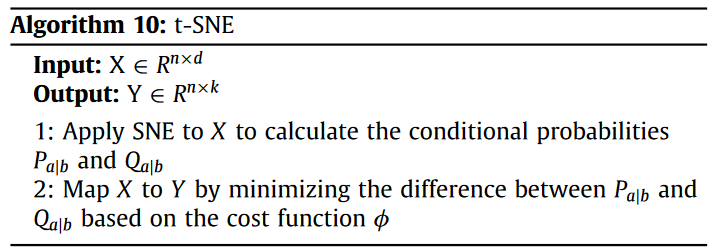
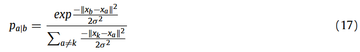

Conceptual and empirical comparison of dimensionality reduction algorithms (PCA, KPCA, LDA, MDS, SVD, LLE, ISOMAP, LE, ICA, t-SNE)
https://doi.org/10.1016/j.cosrev.2021.100378

### Abstract
特征提取算法(Feature Extraction Algorithms，FEAs)旨在解决使机器学习算法无法胜任的维数灾难(the curse of dimensionality)问题。我们的研究从概念和实证上探讨了最具代表性的FEA。首先, 我们回顾了来自不同类别(线性vs非线性, 有监督vs无监督, 基于随机投影vs基于流形)的许多FEA的理论背景, 介绍了它们的算法, 并对这些方法进行了概念性的比较. 其次, 针对3个具有挑战性的二分类和多分类数据集, 我们确定了新特征的最优集合, 并评估了各种变换特征空间在统计显著性和功效分析方面的质量, 以及FEA在分类精度和效率.

### 1. Introduction
如今每天都有大量的数据被收集。因此, 有许多数据处理方法被应用, 但只有一部分对决策任务有用. 虽然机器学习算法(Machine Learning Algorithms，MLAs)可以处理大数据, 但其性能会随着维度的增加而降低. 当属性数量增加时, 观测值的数量成比例增加, 因此学习到的模型变得更加复杂. 在许多特征上训练的模型变得强烈依赖于数据, 因此导致过拟合和在未知数据上的低性能。由于涉及不重要和相似的特征, 模型的准确性降低. **降维算法旨在解决维数灾难, 以提高数据质量为目标.**

它们主要分为**特征选择**和**特征提取**. 前者寻找信息量最大的特征, 剔除信息量较小的特征; 后者通过代数变换将特征组合成更少的新特征。在我们的研究中, 我们关注特征提取算法( Feature Extraction Algorithms, FEAs), 因为它们可以更好地处理实际数据集中的问题, 如噪声、复杂性和稀疏性, 这就是为什么FEAs吸引了研究界更多的关注.

一般来说, FE是将二维空间中的列数降下来或将球体转换为圆的过程. FEAs通过保持原始特征的内在属性或结构, 即以最小的信息损失, 线性或非线性地将相关特征组合成人工特征. FEAs寻找一个**流形(manifold)**的表示来投影输入数据, 然后确定一个嵌入在输入空间中的低维空间. FEAs有几个优点, 包括:
* 通过更少的误导和冗余特征来提高MLAs的性能.
* 通过更少的特征来避免过拟合, 因此模型的假设更小, 模型更简单.
* 更少的计算时间和更少的存储需要更低的数据维度
* 更容易的数据可视化和解释.

我们研究了来自不同类别的各种FEA, 因为它们没有明确的赢家, 因为**FEA取决于数据特征、质量和大小**. 例如, 对于具有"采样良好的光滑流形"的数据, 非线性FEA具有更好的性能; 当数据位于光滑线性表面时, 线性方法的性能最佳. **文献[4]在真实和人工数据集上对多个非线性有限元分析和一个线性有限元分析, 即主成分分析(Principal Component Analysis, PCA)进行了实证研究. 他们的结论是，尽管非线性方法被提出以克服线性方法的缺点, 但非线性FEA在人工任务上表现更好, 不一定在实际任务上表现更好. 此外, 非线性FEAs并不总是优于PCA, 因为它们可能对维数灾难很敏感.** 最近的另一项工作回顾了几种有监督的FEA, 并表明它们的准确性可能会受到数据集样本量的显著影响.

一些研究回顾了FEA背后的复杂理论, 每个研究使用不同的概念和背景. 我们的目标是方便地**描述大量来自不同类别的FEA的行为, 并提供更简单的算法来增加它们的可理解性.** 此外(Additionally), 我们还给出了两个表格, 总结了FEA的分类和几个关键概念. 此外(Moreover), 我们**基于三个不同维度和分类设置的真实世界数据集, 使用多个质量度量指标对FEA进行了广泛的实证研究**。据我们所知，没有任何研究在一个地方提供了详细的理论分析和广泛的实验研究。

在我们的研究中, 我们首先将FEA分为三类：**线性/非线性, 有监督/无监督, 基于随机投影/基于流形.** 然后，根据过去的研究结果，我们提供了选择某些FEA和拒绝其他FEA的理由。因此，我们从理论上研究了9种引人注目的FEA，给出了它们的算法，并使用数据特征、转换方法、计算复杂性、弱点和调整参数等几个因素从概念上对它们进行了比较。最后，我们在3个具有挑战性的真实数据集上评估了所检验的FEA的性能.

在前两个二类数据集中, 相比于数据维度, 实例数量相对较少: **第一个特征有96个特征和200个数据点**, **第二个特征有10, 000个特征和200个数据点.** **第三个多类数据集有561个特征, 10299个实例, 6个类.** 正如[6]中提到的, 对于一个鲁棒的学习, 数据的数量应该与特征的数量成比例地增长. 例如, 第一个数据集至少需要1096个数据点. 我们基于相关性度量来评估各种简化特征空间的质量, 例如统计显著性和功效分析, 以及数据可视化. **我们还设计了一种方法来确定每个FEA的最优新特征集, 然后评估最优新特征的性能**.

### 2. 分类与选择
#### 2.1 分类
**特征提取算法** 可以分为不同的类别, 如下面所示:
##### a. 是否线性
**线性FEAs**:
将高维空间线性映射到低维空间, 即低维空间是原始空间的线性组合. 如**奇异值分解(Singular Value Decomposition, SVD)**, **主成分分析(Principal Component Analysis, PCA)**, **小波变换(Wavelet Transformation, WT)**, **线性判别分析(Linear Discriminant Analysis, LDA)**, **独立成分分析(Independent Component Analysis, ICA)**, **因子分析(Factor Analysis, FA)**, **非负矩阵因子(Non-negative Matrix Factor, NMF)** 等.

**非线性FEAs**
将高维空间非线性映射到低维空间. 这一群体依次划分为:
* 全局FEAs, 提供了数据点全局结构的表示: 例如**多维尺度分析(MDS)**, **核主成分分析(KPCA)**, **等距映射(Isomap)** 等。
* 局部FEAs, **在'局部几何接近欧几里得'但'全局几何很可能不是'的流形上有更好的表现[19].** 例如 **自编码器(AutoEncoder)**, **拉普拉斯特征映射(Laplacian Eigen maps, LE)**, **核Fisher判别分析(Kernel Fisher Discriminant Analysis, KFDA)**, 线性扩展LDA, **局部线性嵌入(Locally-Linear-Embedding, LLE)** 和 **t-分布式随机近邻嵌入(t-SNE)** 等.

##### 是否监督
**无监督FEAs** 关注的是没有预先存在的类标签的数据本身, 大多数Feas是无监督的. 例如MDS, SVD,PCA, LLE, Isomap, t-SNE, LE等.

**有监督的FEAs** 在从数据中学习的同时考虑了类标签的信息[20], 例子有LDA和ICA.

##### 随机投影/基于流形
**基于随机投影(Random Projection-based)的FEAs**: 通过使用一个随机矩阵来有效地投影原始数据, 随机矩阵的每一列长度为一个单位(列的每个元素的平方和的平方根和是1), 这保留了数据之间在欧氏空间中的实际相对距离[21, 22]. 例如PCA, LDA和SVD.

**基于流形的FEAs**: **大多数是非线性的, 无监督的[23]和基于邻域图的[4].** 他们主要关注非线性映射, 并假设数据位于低维空间中一个待展开的稠密采样的流形上[18]. 如Isomap, LLE, MDS, Kpca, t-SNE, LE等.

考虑到以上所有类别, 作为例子, **PCA是线性的, 无监督的和基于随机投影的**, 而**ISOMAP是非线性的(全局的), 无监督的和基于流形的**, ICA可以通过保持数据质量的方式采用随机投影作为预处理任务[24]. 此外, FEA还可以根据其本质分为两类:
(1) 凸方法: 如PCA、LLE、LE、Isomap等;
(2)非凸方法: 如Autoencoder等.
相对于非凸方法, 凸方法以不存在局部最优的方式优化目标函数[11].

附注, 关于流形(manifold), 有以下说明:
**流形是几何中的一个概念，它是高维空间中的几何结构，即空间中的点构成的集合。** 可以简单的将流形理解成二维空间的曲线，三维空间的曲面在更高维空间的推广。下图是三维空间中的一个流形，这是一个卷曲面，像一个瑞士卷一样，这个图就表示观察到的数据是三维的，但其本质是一个二维流形，因为曲面是2维的。我们可以想象成输入的数据是三维的，但真正表征这个数据的核心特征就是一个二维的，其余的都是维度都是冗余的，所以这里的二维流形也就是表征这个数据的核心特征！所以深度学习的本质就是说某些高维数据，实际是一种低维的流形结构嵌入在高维空间中，这个低维流型结构就是我们提取得到的重要特征。 图上所标注的两个圈圈，在流形（把卷展开）上本距离非常远，但是用三维空间的欧氏距离来计算则它们的距离要近得多:
流形学习的前提是有一种假设，即 **某些高维数据，实际是一种低维的流形结构嵌入在高维空间中。流形学习的目的是将其映射回低维空间中** ，揭示其本质。
举个例子，比如说我们在平面上有个圆，如何表示这个圆呢？如果我们把圆放在一个平面直角坐标系中，那一个圆实际上就是由一堆二维点构成的。显然如果用二维坐标来表示，我们没有办法让这个二维坐标系的所有点都是这个圆上的点。也就是说，用二维坐标来表示这个圆其实是有冗余的。我们希望，如果能建立某一种描述方法，让这个描述方法所确定的所有点的集合都能在圆上，甚至能连续不间断地表示圆上的点，那就好了！有没有这种方法呢？对于圆来说，当然有！那就是用极坐标。在极坐标的表示方法下，圆心在原点的圆，只需要一个参数就能确定：半径。
参考链接：
https://blog.csdn.net/Rolandxxx/article/details/127318582
https://www.zhihu.com/question/24015486

#### 2.2 选择
我们的策略是根据文献选择最具代表性和最成功的FEA, 从三个主要类别中选择FEA. 文献[25]发现，基于流形的方法, 如LLE、ISOMAP、LE、KPCA和MDS等, 能够更好地适应局部数据结构, 更有效地处理数据非线性, 因此具有较高的效率. PCA及其变体由于其简单性仍然是最受欢迎的方法.

因此，我们研究了以下无监督方法: **PCA, KPCA, MDS, SVD, LLE, LE和ISOMAP. 此外，我们选择了两种有监督的方法, LDA和ICA, 因为LDA在多类设置中表现更好, 而当我们想要将数据表示为独立的子元素时, ICA是有用的.**

另一方面, 由于种种原因, 我们没有考虑以下的FEAs:
(1) FA与PCA有关: 它的使用急剧下降[25]
(2) NMF用于语音识别和计算机视觉[10], 不能处理负值, 我们实验的第一个数据集有40 %的负值;
(3) 自动编码器, 因为自动编码器也对负值敏感;
(4) 小波变换, 主要用于信号处理。

#### 2.3 符号表


### 3. 主成分分析
主成分分析(Principal Component Analysis, PCA)是一种无监督的线性变换算法, 通过确定数据的最大方差来产生新的特征, 称为主成分( Principal Components, PCs)[26]. PCA将高维数据投影到一个新的子空间, 其中正交轴或PC被认为是最大数据方差的方向[26]. 在转换过程中, 第一个PC具有最高的方差, 随后的PC具有递减的方差.

我们总结了算法1中PCA的步骤。PCA构建dxk维变换矩阵W，将原来的d维空间X映射到新的k维空间Y(k <= d) [27]。将线性特征分解方法应用于 **协方差矩阵($X.X^T$)** 以产生特征向量(PCs)和特征值。特征向量表示数据的方向，特征值表示数据的大小。利用特征值对矩阵W中的列进行排序, 其中每一列都是一个特征向量。特征分解方法可以定义为:
**将协方差矩阵分解为另外三个矩阵**
$X.X^T \rightarrow B.D.B^T$
式中：B为包含特征矢量的方阵(d × d), D为对角矩阵(d × d)，其中除主对角元素外，其余元素为零，对角元素为各自的特征值；BT是B的转置矩阵。

在图1中, 我们将PCA应用于ECG200数据集, 可视化了具有96个特征的原始特征空间(浅蓝色)和具有3个特征的新空间(橙色). 从图中可以看出, 原始数据点比较分散，相比之下，新的数据点比较紧凑。因此，有噪声和冗余的机会较少.


**PCA有几个优点[29]: 它是非迭代的，因此耗时较少，可以很好地减少过拟合，还可以用作去噪和数据压缩技术。**
然而，**PCA也有一些缺点[30]: 它仅限于线性的投影，因而不能很好地处理非线性数据; 在应用PCA之前，数据标准化是必须的，否则它将无法找到最优的主成分，因为方向对特征尺度非常敏感；并且，如果不仔细选择PC，可能会发生信息丢失。**

PCA在非线性数据上表现不佳，因为产生的子空间不是最优的[26]。因此，核主成分分析( KPCA )变得很方便。它**利用式(2)所示的"核技巧"K将数据投影到更高的特征空间，从而实现数据的线性分离**[31]:
%20=%20φ(xa)T%20.φ(xb).png)
这里，xa和xb是两个任意的数据点.如算法2所示，KPCA不使用输入X，而是首先利用极坐标将X映射到更高的特征空间φ(X)。核函数避免了数据与函数φ的显式映射，使得整个过程的计算代价更低
KPCA中常用的核函数有:
(1) 数据线性可分: $k(x_a, x_b) = x_a^T x_b +c$
(2) 多项式表示: $k(x_a, x_b) = (\alpha x_a^T x_b +c)^{deg}$
(3) RBF, 例如高斯核, 其中$k(x_a, x_b) = \exp(-\frac{|x_a-x_b|^2}{2\delta^2})$
( 4 ) Sigmoid, 主要应用于神经网络，其中$k(x_a, x_b) = \tanh(x_a^T x_b +c) $[33]. 在应用核技巧之后，对新的线性可分数据使用PCA进行降维:


### 4.  Linear Discriminant Analysis
大多数时候，线性判别分析( Linear Discriminant Analysis，LDA )被定义为线性的、有监督的FEA。然而，一些作者声称LDA也是一个线性分类器[23]。**LDA以最大化类间可分性为目标，确定一个新的特征空间对数据进行投影。** 它从一个数据集的d个独立特征中，提取出k个新的独立特征, 这些独立特征最能分离类别(依赖特征)。因此, 产生的分量的个数小于类的个数-1.
LDA建立两个散布矩阵:

(1) 类间距离( SMb )矩阵，用于计算每个类的均值之间的距离；
(2) 类内距离( SMw )矩阵，用于返回每个类的均值与该类内数据之间的距离。

这里, m是类的个数, μ是总体均值, μk和$N_k$分别是各自类的均值和大小，μ′k是一个类的均值向量。**使用LDA的一个主要缺点是，对于二分类问题，无论原始数据集中存在多少个特征，我们都只有一个新的特征。**

PS: 刘建平Pinard博客
https://www.cnblogs.com/pinard/p/6239403.html
https://www.cnblogs.com/pinard/p/6244265.html
```cmd
LDA用于降维，和PCA有很多相同，也有很多不同的地方，因此值得好好的比较一下两者的降维异同点。
首先我们看看相同点：
1）两者均可以对数据进行降维。
2）两者在降维时均使用了矩阵特征分解的思想。
3）两者都假设数据符合高斯分布。

我们接着看看不同点：
1）LDA是有监督的降维方法，而PCA是无监督的降维方法
2）LDA降维最多降到类别数k-1的维数，而PCA没有这个限制。
3）LDA除了可以用于降维，还可以用于分类。
4）LDA选择分类性能最好的投影方向，而PCA选择样本点投影具有最大方差的方向。
```

### 5. Multi-dimensional Scaling
多维尺度分析( Multi-dimensional Scaling，MDS )是一种非线性、无监督的FEA，关注多维空间中数据之间的关系(相似或不同)[ 35 ]。
MDS主要有两种方法[36]:
度量MDS(Metric MDS, 经典的)和非度量MDS。
在这项工作中，我们涵盖了经典的MDS，也称为 **主坐标分析(Principal Coordinate Analysis)** [26], 它被广泛使用。如算法4所示，MDS一般不涉及数据；相反，它更关注数据对之间的成对差异。MDS通过计算相异度/距离矩阵($d^X$)来定位维度较低的数据点，使得相似的数据聚集在一起，较少相似的数据相距较远.

由于MDS常用于数据可视化，其低维数通常为2维或3维。然而，众所周知，MDS的计算代价是昂贵的。

### 6.  Singular Value Decomposition
奇异值分解(Singular Value Decomposition，SVD )提供了一个用任意维矩阵表示的数据集的精确说明。然而，我们选择的维数(分量)越少，SVD的精度就越低[ 38 ]。通过奇异值分解，根据下面的定理选择前k个最大的奇异值
$X\rightarrow N.S.Z^T$
这里, X是原矩阵，它被分解成三个矩阵. 
* N是具有正交单位向量列的(n × k)矩阵, 即两列的点积等于0(正交, $NN^T=N^TN = I$, N也称为左奇异向量。
* S是一个(k × k)对角矩阵，其中不在主对角线上的元素为0。S的对角线元素称为奇异值。
* Z是一个大小为k × d的正交矩阵，称为右奇异向量。


SVD定理重建了方程( 8 )中k -低维/秩的输入矩阵X，其中$N_k, S_k, Z^T_k$ 是截断版本。这里, Y中只保留前k个奇异值。

### 7.  Locally Linear Embedding
局部线性嵌入( Locally Linear Embedding，LLE )是一种非线性、无监督的提取过程, 通过假设数据位于嵌入在高特征空间的平滑非线性流形上来产生低维的全局坐标[41]. LLE在减少特征的同时, **保留了原始数据集的几何特征(局部属性)** [4]. **通过考虑Wab (重构权重)和它的c -近邻( xb )的线性组合来保持数据点( xa )的局部特性**。

为了进行降维:
* 首先LLE使用欧氏距离找到每个数据的c近邻。
* 其次，通过减少重建误差，计算每个数据点( Xa )的局部权重，将数据( X′a)最优地表示为最近邻的线性组合。
* 第三，通过使用基于特征向量的优化方法定义了一个新的向量空间(点的低维嵌入)Y，该方法通过计算从最近邻居中最佳重建向量(数据点)的权重来最小化Y的成本。

在方程(9)中，我们给出了重构误差[41]. 这里, Wab表示在重建数据点Xa的同时，Xb的贡献。在以下两个条件下误差达到最小：
* 每个数据(Xa)将只从它的最近邻居重建，这使得当Xb和Xa不是邻居时, Wab = 0.
* 权重矩阵的每一行的和为1，即$\Sigma_b W_{ab} = 1$.
每个来自d维的数据Xa通过最小化代价映射到k维的数据Ya，如下所示

LLE的优势在于它能够有效地处理非线性数据和稀疏矩阵。因此，它可能比其他FEAs需要更低的计算时间和空间。

### 8. Isometric mapping
经典缩放(MDS)是一种公认的计算数据不相似度的方法, 其目的是保留数据点的成对距离(欧氏距离), 但不考虑相邻数据的分布. 这意味着经典的缩放并不能捕捉到数据集中可能存在的非线性模式。例如，如果数据点位于非线性流形上，并且应用任何经典的缩放方法(如PCA和MDS)后，流形的不同侧面的数据点会错误地落在彼此的旁边, 因为PCA / MDS不能处理流形中的非线性结构[43]. 因此，需要一种新的方法来考虑流形中数据点的成对距离。ISOMAP, 也称为等距映射，通过在低维空间中保持数据之间的 **"成对测地距离(pairwise geodesic distances)"** 来解决这个问题[44]. **ISOMAP是一种非线性、无监督的FEA, 是最早的流形学习方法之一, 也可以认为是MDS的扩展[23].** 

* 首先通过确定测地距离生成邻域图, 其中数据xa与其最近邻相连. 
* 然后，计算邻域图中所有数据对的最短路径来近似它们之间的测地距离，这可以通过使用Floyd或Dijkstra的最短路径算法[44]来快速完成。
* 然后，计算所有数据点之间的测地距离，构建成对测地距离矩阵(dG), H是中心矩阵.
* 接着，将带有核矩阵的MDS应用于(dG)如下
$K = H.d^G.H$  $(11)$
然后，ISOMAP从方程(6)中找到一个数据点的低维嵌入, ^D和B分别是方程(11)的特征值和特征向量.

### 9. Laplacian Eigenmap
拉普拉斯特征映射(LE)是另一种无监督非线性FEA，它通过保持流形的"局部特性"来寻找低维数据, 这与LLE类似。LE首先生成一个邻域图G′，其中每个数据xa与最近邻相连, G′中的所有xa和xb通过一条边连接, 并使用"高斯核函数"来评估边的权重

$$W_{ab}=\exp(-|x_a-x_b|^2/2\delta^2)$$
其中σ指定通向邻接矩阵( W )的高斯方差, 为了将维度从X降低到Y, LE最小化[49]中定义的代价函数为:
$$\Phi(Y)=\Sigma_{ab}W_{ab}|y_a-y_b|^2=2YLY^T$$
**优化代价函数意味着在高维空间中xa和xb之间有更小的距离, 因此, 在低维空间中ya和yb之间也有更小的距离.** 此外, 通过计算G′的对角矩阵D和拉普拉斯矩阵L, 代价函数转化为特征分解问题:
其中L可定义为L = W - D；这里D是一个对角矩阵，其中元素是W的行和，如$D_{aa} =∑bW_{ab}$, W的元素表示一对顶点是否相邻; W的条目要么为1, 要么为0, 其中对角线条目为0.
Scikit - learn工具使用谱分解来实现LE, 谱分解是LE的特征分解。生成的图被认为是高维中的低维流形的"离散近似". 优化代价函数确认数据点在流形上是相似的, 并通过保持局部距离在低维上映射得更近

### 10. Independent Component Analysis
独立成分分析( Independent Component Analysis, ICA )是一种线性的、有监督的FEA, 它通过减少给定数据集中的高阶和二阶依赖来生成统计独立的新特征[50]. **ICA区别于其他任何FEA的地方在于, ICA搜索的是非高斯且统计独立的特征.** 例如, PCA寻找最能表示数据的方向, 而ICA寻找相互独立(大部分)的方向. 

首先, ICA对数据X进行如下分解:
$$X \rightarrow A.S$$
其中A为混合矩阵, S为基系数, 使得特征尽可能独立. 为了从一个数据集中获得k个维度, ICA通过选择前k个独立分量来产生数据Y:
$$Y = A_kS_k$$
成分可以按不同的顺序、不同的尺度进行回收。ICA的一个限制是通常假设分量是非高斯的, 因为两个高斯变量的线性组合也是高斯的, 这使得分离成为一个不适定问题.
ICA是信号处理领域中"盲源分离"问题的一种特殊情况[51], 它在源信号或混合过程的信息很少或没有的情况下, 从混合数据中分离出原始信号. 在这里，值得一提的是Scikitlearn工具使用快速独立分量分析使得ICA在计算和内存上都是高效的。

### 11. t-Distributed Stochastic Neighbor Embedding
t分布邻域嵌入, t-SNE ( T-Distributed Stochastic Neighbor Embedding )是一种非线性的、无监督的、基于流形的FE方法, 它将高维数据映射到低维的(通常为2或3维), 同时保留原始数据的重要结构[52]. **t-SNE 主要用于数据探索和可视化**. 简而言之, **t-SNE提供了数据如何在高维空间中排列的直观了解.** 尽管FEAs具有强大的性能, 但它们在可视化高维数据方面往往并不成功，并且大多数FEAs不能同时保留数据的局部和全局结构[52]. 在这种情况下, t-SNE通过保留数据的显著结构, 为可视化高维数据提供了便利.

t-SNE首先将随机邻域嵌入( Stochastic Neighbor Embedding，SNE )应用于数据集, 将高维欧氏距离转化为条件概率, 表示每对数据的相似性, 数据xa与数据xb的相似度由条件概率pa|b表示, 定义在下面的方程中[52]:

式(17)衡量了一个数据点xa与另一个数据点xb的接近程度，考虑xb周围服从给定方差为σ2的高斯分布。这个方差对于每个数据是不同的，并且选择的方式是密集区域的数据比稀疏区域的数据具有更小的方差[52]。
此后, 再使用高斯分布, 而是使用一个自由度类似于柯西分布的"学生t分布"来获得低维空间中的第二组概率(Qa|b)[54]. **如果将高维数据xa和xb正确映射到低维数据ya和yb, 那么Pa|b和Qa|b的相似度就相等. 因此, t-SNE从低维到高维空间最小化了这两种概率之间的差异**. 这种差异是通过优化库尔贝克-莱布勒散度之和的代价函数(φ)来衡量的, 如[54]所示:


### 12. Summary and comparison
表2和表3总结了FEAs的关键概念。例如，SVD是基于无监督的、线性的、迭代的、随机投影的，利用SVD定理通过最小化重构误差来进行特征变换，并且具有两个超参数：PC个数和迭代次数。ISOMAP是一种无监督的、非线性的、非迭代的、基于流形的、利用邻接图来计算成对测地距离的方法，它有两个超参数：PC的个数和最近邻的个数。

对于本文所研究的方法，我们观察到基于流形的方法是非线性的，而基于随机投影的方法是线性的。迭代方法耗时更多，如时间复杂度一栏所示。LDA是唯一不具有调谐参数的FEA。


First case study
我们使用ECG200数据集评估FEAs的性能，该数据集包含96个实值特征。该数据集在[ 55 ]中被格式化，并在MIT - BIH Arrhythmia Database CD - ROM及其附属的在线数据库PhysioNet [ 55 ]中公开。由领域专家进行分析，并注释为正常或异常(心肌梗死)心跳。然而，它只包含200个观测值，其中133个是正常的，67个是异常的。由于我们的数据集相对较小，需要使用FEAs来提高MLA的性能。为了进行实验分析，我们使用了来自Anaconda的Scikit - learn工具包，这样我们可以利用现有的FEA库。
1. Feature scaling
在图2中，我们绘制了随机选择的一些特征的直方图，以可视化它们的分布。我们观察到特征具有不同的值分布。Feature # C55有一个左偏的直方图，其中均值小于中位数。在这种情况下，相对较小值的存在使这一特征的均值下降。另一方面，如果直方图右偏，如Feature # C92，则均值大于中位数。这种情况发生在偏右数据有一些高值将均值向上推的时候。对称数据，如Feature # C20，两侧的形状几乎相同。最后，Feature # C43显示多峰直方图，这意味着该特征具有两个或多个峰值(局部极大值)。因此，该数据集很好地结合了来自不同分布的特征。
在将FEAs应用于ECG200数据集之前，我们首先对特征进行标准化，因为它们具有不同的分布：最大值为4.1991449，最小值为- 3.0144511。一些FEA，如PCA，KPCA和大多数MLA对数据缩放敏感。因此，我们使用Scikitlearn的StandardScaler对所有特征进行缩放，使其标准差为1，均值为零，范围为[ - 1、1]。

2. Optimal number of PCs
出现的一个重要问题是如何确定将导致最高精度的最佳PC数量。对于PCA和KPCA，我们认为方差越大，数据的代表性越好，因为PCA追求方差的最大化[ 27 ]，以便从数据中获得独特的信息。从图3可以看出，在65 +个特征下获得了100 %的"累积解释方差"。该指标表示新特征的方差之和，并给出前65个主成分方差的百分比。由于65是第一个产生100 %累积方差的PC个数，因此我们选择它作为最优的PC个数。
如前所述，对于LDA方法，PC的个数应该小于类数- 1。由于我们的数据集只有两类，所以PC的数量应该等于1。对于剩余的FEA，如算法11所示，我们通过计算预测精度来决定最佳的PC数量。通过将PC的数量从1变化到最大维度(这里96 )，我们寻找提供最佳性能的数量。由于FEA的广泛使用和高性能的[ 56、57 ]，我们选择SVM算法来评估FEA的性能。我们使用分层的十折交叉验证在96个转换后的数据集上训练SVM，其中，模型的最终精度是十次游程的平均精度。

3. Quality of transformed data
为了评估生成数据集的质量，我们比较了原始数据集的类列和第一个特征，以及新数据集的类列和第一个成分之间的相关性，即p值和功效分析。我们仍然使用LDA和t - SNE进行实验，但在比较FEA时，我们将它们排除在外，因为对于本数据集(两个特征的性能优于三个特征的性能)，LDA只将输入空间减少到一维，t - SNE减少到二维。p值量化了检验的统计显著性，并以固定的显著性水平进行评估。如果得到的p值小于这个固定水平，则结果具有统计学意义[ 58 ]。在我们的实验中，低p值意味着拥有更好数据的可能性更高[ 58 ]。检验效能是指如果原假设在检验中为假，那么采取一个精确的决定使其无效的可能性。因此，功率值越高，数据越稳健[ 59 ]。
大多数非线性方法都有超参数的调节。我们将MDS的迭代次数优化到300，LLE的迭代次数优化到100，SVD的迭代次数优化到5。对于KPCA，RBF核比线性核具有更好的精度。对于ICA，我们将迭代次数调整为500，并将容忍度设置为0.5。
在表4中，我们优化了最近邻居的数量( c )。由于ECG200数据集只有200个数据点，我们选择[ 2、5]的小范围。LLE、ISOMAP和LE的最佳c值分别为4、3和4。然而，对于LE，我们得到了相同的p值，且c = 4和5的幂次。我们选择4而不是5，因为它需要更少的计算量。表5给出了原始数据集和转换后数据集的p值和功效分析。应用FEAs后，我们获得了比原始数据集产生的值更低的p值和更高的功率分析。因此，新的精简数据集比原数据集具有更好的质量。对于p - value和power，MDS和KPCA都得到了最好的结果，其次是LLE。与原始数据集的p值( 0 .

4. Classification performance
我们在表6中展示了原始数据集和9个转换数据集的训练性能。在新的特征空间上训练RBF核的SVM分类器。表6显示了应用FEAs前后的F1值和毫秒( ms )运行时间。在具有96个特征的原始数据上，SVM返回了89.66 %的F1值，速度为200ms。显然，分类器在新的精简数据集上表现更好。为了进行比较，我们不考虑LDA的准确性，因为它只返回该数据集的一个特征。其中，KPCA的性能最好，其次是ICA和PCA / SVD。
原始特征空间与最佳降维特征空间(采用KPCA )之间存在3.43 %的差距，这在医疗诊断领域是显著的。然而，ISOMAP提供了最低的准确率，这是预期的，因为它具有最高的组件数量( 81 )，并且分类器对大量的特征敏感。我们还可以看到，PCA的分类速度最快，只有3.6 ms，其次是SVD，为7 ms。使用MDS进行分类的最大时间为122.8 ms。
在表7中，我们对数据质量(相关性)和分类性能进行了排序。对于这两种情况，KPCA都是最顶级的FEA。此外，基于线性和随机投影的方法，如SVD和PCA，在数据质量方面排名第四，在分类方面排名第三。另一方面，监督线性方法ICA获得了数据质量的第七位；然而，它的分类性能排名第二。KPCA与ICA / PCA / SVD的f值差距分别为0.32 %和0.98 %。此外，KPCA与ICA / PCA / SVD在数据质量方面存在明显差距。我们可以做三个主要的观察：
( 1 )非线性FEA结果优于线性FEA结果；( 2 )，基于流形的FEAs比基于随机投影的方法更好；( 3 )无监督FEA比有监督FEA表现更好。
在下面的图4中，我们展示了在使用KPCA进行分类之前，为了更好地可视化和理解，我们使用KPCA获得的原始数据集和缩减数据集的散点图。这里，很明显，原始数据集( a )是一个非线性数据集，应用KPCA后，缩减后的数据集( b )被很好地分为两类。


Second case study
基准的Arcene数据集是通过合并三个质谱数据集而开发的。在给定的质量值下，这些特征决定了人血清中蛋白质的丰度。基于这些特征，可以将癌症患者与健康患者区分开来。除了7000个原始特征外，数据集的创建者还增加了3000个探针特征(不具有任何预测能力)，使数据集成为特征选择/提取任务的理想选择[ 60 ]。该数据集于2008年在UCI数据库中公开，共有10 000个特征，但只有200个样本，而且几乎是平衡的。像此前对于ECG200数据集所做的那样，我们将所有特征归一化到[ - 1、1]的范围内。
1. Classification performance
为了寻找每个FEA的最佳元件数，我们遵循第13.2节和算法11中提出的相同方法。例如，PCA和KPCA将维度从10，000降低到200（所有FEA中最大减少的特征数），这意味着在第200个PC中获得了100 %的"累积解释方差"。表8报告了每个FEA的最佳PC数。ISOMAP将维度从10，000降低到57 (最小约化数)。在所有情况下，FEAs显著降低了特征的数量。新的特征空间将解决数据的存储和可视化问题，并将提高分类器的准确性。
我们在各种简化的数据集上训练了一个RBF + SVM分类器，并在表8中报告了其性能。LE (无监督的、非线性的和基于流形的)和SVD (基于无监督、线性和随机投影)分别以96个新特征和76个新特征提供了84.82 %和84.81 %的最佳F1值。SVD和LE的性能相当，但SVD的速度几乎是LE的两倍。相比之下，表现最差的方法再次是ISOMAP (非线性,无监督和基于流形的)，其返回的F1值为67.65 %。
在时间效率方面，KPCA是最快的方法，仅需191.1 ms，而MDS需要的最大时间为1778.7 ms。虽然LE提供了最好的准确性，但它在速度方面排名第四( 606.4 ms )。原始数据集产生了63 %的低准确率，以及4856.2 ms的非常高的运行时间。在这里，原始数据集和最佳缩减数据集之间的精度差距为21.82 %，这意味着采用FEA后精度大大提高。此外，使用KPCA后，分类器的速度几乎是未使用FEA的SVM的25倍。再次，t - SNE提供了两个维度比三个维度更好的F1得分。
2. Data plotting
此外，我们绘制了原始Arcene数据集，以及图5中的最佳缩减数据集。图5 ( a )表明，所有数据都倾向于纵轴和横轴，并且是分散的。在图5 ( b )中，应用LE后，所有的数据都偏离了坐标轴，并且在特征空间中分布良好。


Third case study
这一次我们处理了一个名为"使用智能手机的人类活动识别( HAR ) "的多类数据集，该数据集于2012年在UCI数据库中公开。该数据集包含六个类别对应于六项活动(坐、走、站、走_上楼、走_下楼、躺)，10299个样本，561个特征。这6类具有几乎相同的分布。特征已经缩放到[ - 1、1]的范围内。我们应用所选择的FEAs，并评估它们在多类别背景下的有效性。为了获得该数据集的最优特征空间，我们遵循第12节中所述的相同策略。
1. Classification performance
从表9中，我们注意到，由于数据质量高，未经任何降维的SVM分类器提供了95.05 %的高f值。应用FEAs后得到的最佳f值( 98.48 % )是LDA (有监督的,基于线性和随机投影的)，其缩减的特征空间只有5个成分。得益于LDA，新的数据集需要更少的存储空间，并将极大地促进数据的绘制和分析。第二个最好的准确率为96.79 %，是基于无监督、非线性和流形的KPCA，有300个PC，第三个顶级分类器是ICA (有监督的,基于随机投影的和线性的)，有226个组件，返回95.75 %。性能最差的分类器是MDS，使用478个新特征，准确率为92.5 %。另一方面，没有FEA的SVM需要156，090 ms的高处理时间，而LDA只需要1，244.8 ms。MDS取最大时间126，865.8 ms (比LDA慢102倍)。我们还可以看到，t - SNE和MDS对6类数据的设定是无效的，因为它们提供的精度低于原始数据。
2. Data plotting
最后，我们将原始数据集和最优约简数据集绘制在图6中。显然，原始数据集是非线性的，LDA得到的新数据集有利于六类的可视化和分离。

FEA comparison for all three case studies
表10报告了3个调查数据集的前3个FEA。正如观察到的，SVD是无监督的，线性的和基于随机投影的，在ECG200和Arcene数据集上面表现的相当不错。此外，KPCA在ECG200和HAR数据集上也取得了很好的效果。此外，由于FEAs依赖于数据的性质和质量，这3个数据集的性能之间存在显著的差距。案例研究表明，在两个数据集上，无监督、非线性和基于流形的FEA都优于线性、有监督和基于随机投影的FEA，而在最后一个数据集上，有监督、线性和基于随机投影的FEA效果最好。因此，没有明确的赢家，实证分析对于确定数据集的最优FEA是必不可少的。


Conclusion and future work
训练数据集应该是高质量的，不具有无关紧要和冗余的特征；否则，预测将是不可靠的。在本文中，我们首先从理论上描述和比较了属于不同类别的多种FEA。然后，我们在二分类和多分类场景下对不同数据集上的FEAs性能进行了实证评估和比较。我们使用相关性、分类和运行时度量来评估各种变换后的特征空间的质量。基于实验结果，我们可以做两个主要的观察：
( 1 )应用FEAs后，数据质量和分类精度均有提高，在某些情况下，提高幅度较大；( 2 )在大多数情况下，非线性FEAs的性能优于线性FEAs，基于流形的FEAs的性能优于基于随机投影的FEAs。
此外，在多类情况下，有监督的FEAs比无监督的FEAs表现更好，其中一个无监督的FEA对此设置无效。对于未来的研究方向，我们将探索基于FEAs的深度学习在高维数据集上的表现。此外，我们将在更复杂的数据集上探索FEAs，例如多维时间序列和多标签数据。


流形学习（manifold learning）是机器学习、模式识别中的一种方法，在维数约简方面具有广泛的应用。它的主要思想是将高维的数据映射到低维，使该低维的数据能够反映原高维数据的某些本质结构特征。流形学习的前提是有一种假设，即某些高维数据，实际是一种低维的流形结构嵌入在高维空间中。流形学习的目的是将其映射回低维空间中，揭示其本质。流形学习可以作为一种数据降维的方式。此外，流形能够刻画数据的本质，主要代表方法有等距映射、局部线性嵌入等。