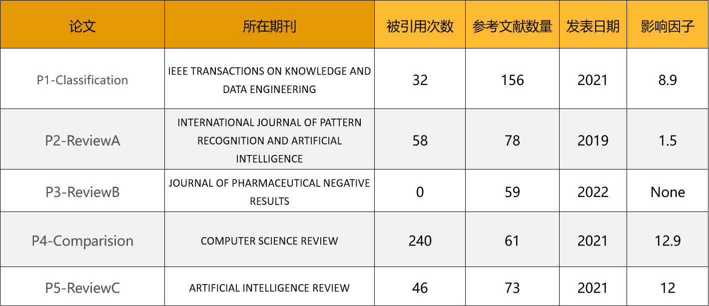

主要是查找关于 DR(Dimensionality Reduce) 的综述性论文

一共找到 5 篇:
A review on dimensionality reduction for multi-label classification
多标签分类中的降维算法综述（P1-Classification）
A Review on Dimensionality Reduction Techniques
关于降维算法的综述（P2-ReviewA）
A Review Paper on Dimensionality Reduction Techniques
关于降维算法的综述（P3-ReviewB）
Conceptual and empirical comparison of dimensionality reduction algorithms
降维算法的概念和实证比较（P4-Comparision）
Various dimension reduction techniques for high dimensional data analysis: a review
高维数据分析的各种降维技术：综述（P5-ReviewC）

